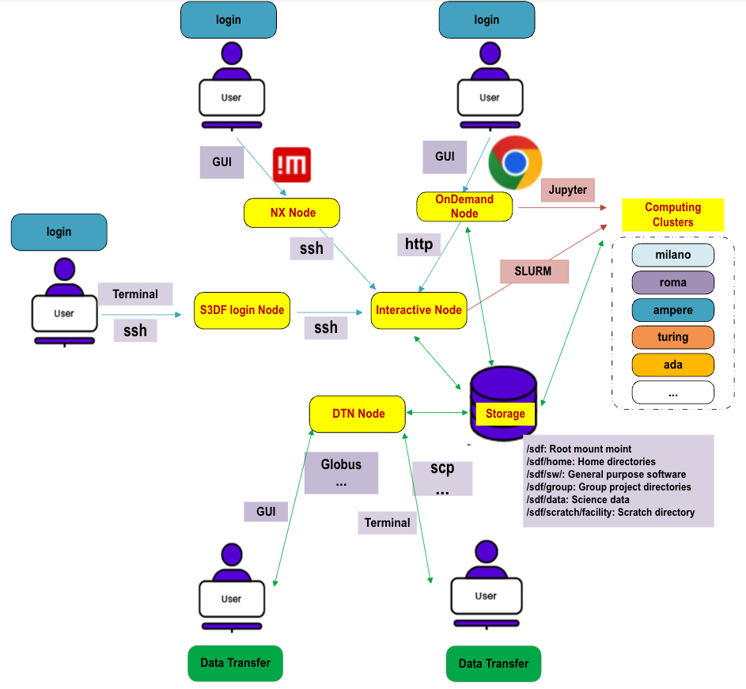

Welcome to the SLAC Shared Scientific Data Facility (S3DF). The S3DF
is a compute, storage and network architecture designed to support
massive scale analytics required by all SLAC experimental facilities
and programs, including LCLS/LCLS-II, UED, cryo-EM, the accelerator,
and the Rubin observatory. The S3DF infrastructure is optimized for
data analytics and is characterized by large, massive throughput, high
concurrency storage systems.

## Quick Reference

- [Get Started](getstarted.md) - Information for new and existing S3DF users
- [Beginner's Guide](beginnerguide.md) - Step by step guide for new users
- [Get Help](contact-us.md) - How to get help
- [OnDemand Document](interactive-compute.md#using-a-browser-and-ondemand)- Access S3DF through Open OnDemand via any (modern) browser
- [Jupyter](interactive-compute.md#jupyter) - Interactive Jupyter Notebooks at S3DF
- [Example Job Scripts](reference.md#create-a-batch-script) - example job scripts
- [Systems](batch-compute.md#cluster-and-repos) - Computing resources at S3DF

| Access 	| Address | 
| :--- | :--- |
| SSH 	|  s3dflogin.slac.stanford.edu|
| NoMachine |  s3dfnx.slac.stanford.edu|
| OnDemand 	| [https://s3df.slac.stanford.edu/ondemand](/ondemand ':ignore') |	
| Globus Endpoint 	| slac#s3df_globus5|
| Documentation | [This!](/ ':ignore')|
| Help (slack channel) | [slac.slack.com#comp-sdf](https://app.slack.com/client/T1X4J8FJ8/C01965DTG91)|
| Help (email) | s3df-help@slac.stanford.edu|
| Banking & Accounting | https://s3df.slac.stanford.edu/coact|
| S3DF Dashboard & Monitoring | https://grafana.slac.stanford.edu|

