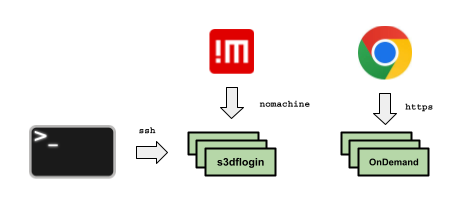

# Accounts and Access

## How to get an account :id=access

If you are a SLAC employee, affiliated researcher, or experimental
facility user, you are eligible for an S3DF account. **S3DF authentication requires a SLAC UNIX account. The legacy SDF 1.0 environment required a SLAC Active Directory (Windows) account. These are not the same authentication system.**

1. If you don't already have a SLAC UNIX account (the credentials used to log in to SLAC UNIX clusters such as `rhel6-64` and `centos7`), you will need to acquire one by following these instructions. **If you already have an active SLAC UNIX account, skip to step 2**:
  * Affiliated users/experimental facility users: Obtain a SLAC ID via the [Scientific Collaborative Researcher Registration process](https://it.slac.stanford.edu/identity/scientific-collaborative-researcher-registration) form (SLAC employees should already have a SLAC ID number).
  * Take the appropriate cybersecurity SLAC training course via the [SLAC training portal](https://slactraining.slac.stanford.edu/how-access-the-web-training-portal):
      * All lab users and non-SLAC/Stanford employees: "CS100: Cyber Security for Laboratory Users Training".
      * All SLAC/Stanford employees or term employees of SLAC or the University: "CS200: Cyber Security Training for Employees".
      * Depending on role, you may be required to take additional cybersecurity training. Consult with your supervisor or SLAC Point of Contact (POC) for more details.
  * Ask your [SLAC POC](contact-us.md#facpoc) to submit a ticket to SLAC IT requesting a UNIX account. In your request indicate your SLAC ID and your preferred account name (include a second choice in case your preferred username is unavailable).
2. Register your SLAC UNIX account in S3DF:
  * Log into the [Coact S3DF User Portal](https://s3df.slac.stanford.edu/coact) using your SLAC UNIX account via the "Log in with S3DF (unix)" option.
  * Click on "Repos" in the menu bar.
  * Click the "Request Access to Facility" button and select a facility from the dropdown.
  * Include your affiliation and other contextual information for your request in the "Notes" field, then submit.
  * A czar for the S3DF facility you requested access to will review your request. **Once approved by a facility czar**, the registration process should be completed in about 1 hour.

?> To access files and folders in facilities such as Rubin and LCLS, you will need to ask your SLAC POC to add your username to the [POSIX group](contact-us.md#facpoc) that manages access to that facility's storage space. In the future, access to facility storage will be part of the S3DF registration process in Coact.

?> SLAC IT is currently working on providing federated access to SLAC resources, which will enable authentication to SLAC computing systems with a user's home institution account rather than a SLAC account. Federated authentication is expected to be available in late 2024.

## Managing your UNIX account password

You can change your password via [the SLAC UNIX self-service password update site](https://unix-password.slac.stanford.edu/).

If you have forgotten your password and need to reset it, [please contact the IT Service Desk](https://it.slac.stanford.edu/support).

Make sure you comply with all SLAC training and cybersecurity requirements to avoid having your account disabled. You will be notified of these requirements via email.

## How to connect

There are three mechanisms to access S3DF:

1. **SSH**: You can connect using any SSH client, such as [OpenSSH](www.openssh.com) or [PuTTY](https://www.chiark.greenend.org.uk/~sgtatham/putty/), on the standard TCP port 22, to connect to the S3DF load-balanced bastion pool `s3dflogin.slac.stanford.edu`. These hosts shall require multi-factor authentication; for more information on working with the MFA systems, please see [SSH and MFA](sshmfa_user.md).

?> Note that these nodes do not have access to storage (except for your home directory). From these bastion hosts, you should hop to an [Interactive Node](interactive-compute.md#interactive-pools) to access S3DF batch compute and storage.

?> Windows users may see an error message about a "*Corrupted MAC on input*" or "*message authentication code incorrect.*" The workaround is to add "*-m hmac-sha2-512*" to the ssh command, i.e. `ssh -m hmac-sha2-512 <username>@s3dflogin.slac.stanford.edu`

2. **NoMachine**: NoMachine provides a special remote desktop that is specifically designed to improve, compared to ssh, the performance of X11 graphics over slow connection speeds. Another important feature is that it preserves the state of your desktop across multiple sessions, including when your internet session unexpectedly gets dropped. The login pool for NoMachine is `s3dfnx.slac.stanford.edu`. You can find more information about this access mode in the [NoMachine reference](reference.md#nomachine).

3. **OnDemand**: If you do not have a terminal handy or you want to use applications like Jupyter, you can also launch a web-based terminal using OnDemand: [`https://s3df.slac.stanford.edu/ondemand`](https://s3df.slac.stanford.edu/ondemand). You can find more information about using OnDemand in the [OnDemand reference](interactive-compute.md#ondemand).

