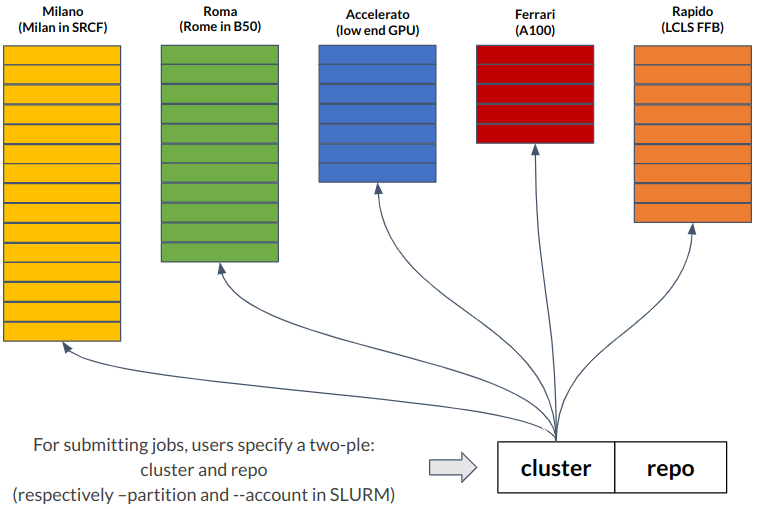
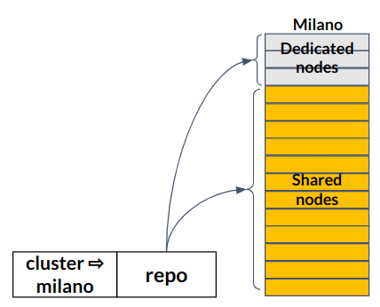

# Batch Compute

## Slurm

Slurm is a batch scheduler that enables users to submit compute jobs
of varying scope to our compute clusters. It will queue up jobs such
that the compute resources available in S3DF are fairly and
efficiently shared and distributed for all users. This page describes
S3DF specific Slurm information. If you haven't used Slurm before, you
can find general information on using this workflow manager in our
[Slurm reference FAQ](reference.md#SlurmFAQ).

## Clusters & Repos

A cluster is a homogeneous set of computing nodes with the same
hardware specifications and the same access to the storage. A
[facility](contact-us.md#facpoc) is an entity (organization, project,
group, program, etc) which owns resources within S3DF. A repo is a set
of resources associated with a group of people within a facility
(e.g., an LCLS experiment, a cryo-EM experiment, an effort within the
accelerator directorate, etc). Not all repos will have access to all
clusters. Some repos will have dedicated resources within a cluster,
while some will use shared resources.

Typically, a facility will acquire hardware in order to own resources
within S3DF, but resources can also be assigned by SLAC. [Talk with
us](contact-us.md) if you don't have funds to buy hardware but you
would like to use dedicated resources within the S3DF.

### Partitions & Accounts

For submitting jobs, you need to specify a two-ple: the cluster
(--partition in Slurm terminology) and the repo (--account in
Slurm). These two parameters indicate, respectively, which hardware to
use and repo to charge for that particular job. Use coact to determine
how many computing hours your repo has on a specific cluster.

Each repo can have one of three stances in relation to a specific
cluster:

1. Dedicated resources: for repos with real time requirements or with
  uniform usage over time (for that cluster). A subset of super-users
  from each facility will be allowed to create reservations. Users
  will submit jobs for this stance using the repo name and reservation
  name. Example:
  `--partition milano --account lcls:xpp1234 --reservation lcls:xpp1234-230101-230105`

2. Shared resources with priority: for repos within their quota (for
  that cluster). This is the default stance and users will submit jobs
  for this stance using the repo name. Example:
  `--partition milano --account lcls:xpp1234`

3. Shared resources without priority: for repos above their quota (for
  that cluster). Jobs in this category may be preempted by higher
  priority jobs. This is the opportunistic cycles stance, aka
  scavenger cycles, and jobs are submitted under the facility account
  and quality of service preemptable. Example:
  `--partition milano --account lcls --qos preemptable`

As a matter of convention:

- Default Slurm account = `<facility>`
- Repo Slurm account = `<facility>:<repo>`
- Slurm reservation = `<facility>:<repo>-<starttime>-<endtime>`

The mapping of repos to dedicated resource is dynamic. This is
required, for example, to assign different nodes to a repo so that a
rolling upgrade does not cause an outage for stance 1, or to change
the amount of resources dedicated to real-time and fast-feedback
activities within a cluster to match the actual requirements of a
running experiment.

See the table below to determine the specifications for each
cluster/partition.

| Partition name | CPU model | Cores per node | Memory per node | GPU model | GPUs per node | Local scratch | Number of nodes |
| --- | --- | --- | --- | --- | --- | --- | --- |
| roma | Rome 7702 | 128 | 512 GB | - | - | 960 GB | 39 |
| milano | Milan 7713 | 128 | 512 GB | - | - | 960 GB | 120 |
| ampere | Rome 7542 | 64 | 1024 GB | Tesla A100 | 4 | 7 TB | 23 |

### Banking

The coact system will keep track of the hours spent by each repo on
each clusters. Once a repo reaches its computing quota on a cluster,
further submissions to that cluster will have lower priority. Note:
depending on the initial experience, we may also limit the resources
available to over-quota repos (i.e., by enforcing a cap on the amount
of cores, or memory, a job may take), and allow higher priority jobs
to preempt lower priority ones. Allocations will reset on a calendar
year boundary, i.e., on December 31st

