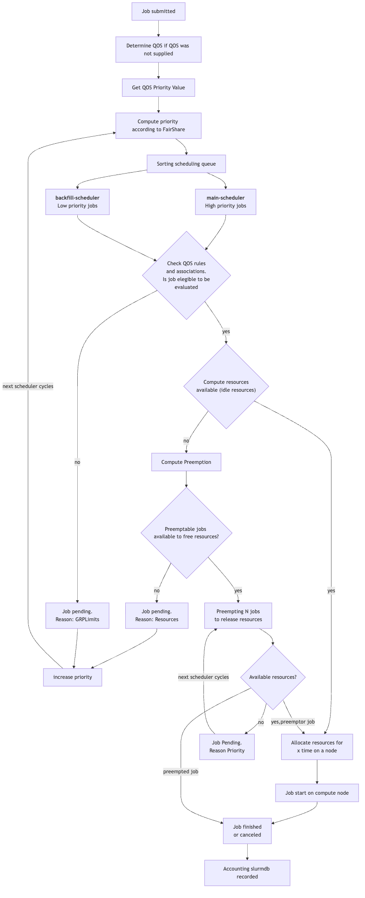
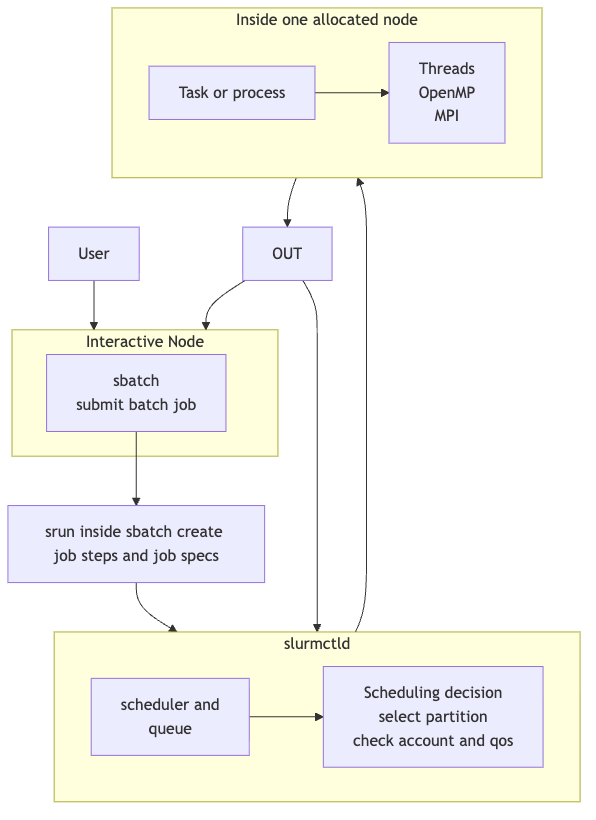

# S3DF SLURM USER DOCUMENTATION
## Overview
This documentation provides a practical S3DF-specific guide for users of SLURM. The goal are to:
1. Explain the relation between COACT and SLURM
2. Explain how accounts, QOS and jobs limits works on S3DF
3. How preemptable jobs behaves and when those types of jobs are beneficial
4. Help users troubleshoot common issues such as limits, pending jobs or job preemption

At S3DF, **SLURM is configured to reflect Coact’s resource ownership model**. Your batch jobs are scheduled not just “as a user”, but **as a user acting within a Coact `Repo`, which itself belongs to a Coact `Facility`**. This linkage is what allows:

- **Facilities** to prioritize use of their **dedicated/purchased nodes** by their own users.
- **Facility administrators (“CZAR's”)** to allocate CPU/memory/GPU capacity across the Repos they oversee.
- SLURM to enforce fair use and prevent any single group from overrunning shared capacity via **Association limits**

---

## Core concepts and how they map

### Coact objects
- **Facility**: an organizational/ownership unit (often aligned with hardware funding/ownership).
- **Repo**: a project/workgroup under a Facility. This is the unit where allocations are typically managed for day-to-day compute use.
- **CZAR**: a Coact role for Facility-level administrators who can allocate resources (CPU, memory, GPU, etc.) to Repos.

### SLURM objects (as configured at S3DF)
- **SLURM Account**: the primary accounting and policy handle used for scheduling and limits.
- **SLURM Association**: the binding between *(user, account, partitions/qos, and limits)*. This is where many throttles/quotas are applied.

At S3DF, **the SLURM account name encodes the Coact hierarchy**:

- **SLURM account** = `<facility>:<repo>`
- Example form: `FACILITY_A:repo1`

This is the key: **SLURM accounts are not arbitrary**—they are intended to correspond 1:1 with **Coact Repos**, namespaced by **Facility**.

---

## How your job is “tied” to Coact

When you submit a job, SLURM needs to know which **account** it should charge and schedule against. At S3DF that means:

1. You choose (explicitly or implicitly) a **SLURM account**: `<facility>:<repo>`
2. That account corresponds to a **Coact Repo**
3. That Repo belongs to a **Facility**
4. SLURM scheduling and limits are then applied using that **Association** (your user + that account)

Practically, this means your job is evaluated within a hierarchy:

- **Facility-level context** (ownership/priority intent, dedicated nodes, facility-wide limits)
- then **Repo-level allocations** (what the CZAR has granted that Repo)
- then **user-level limits** (if configured for the association)

---

## Why the Facility hierarchy matters (priority + immediacy)

Some Facilities have acquired or purchased **dedicated compute nodes** to serve their users. The SLURM configuration is built to preserve the value of that investment:

- **Facility users should be able to run on Facility-owned hardware with immediacy**
- Other work should not be able to swamp that capacity simply by submitting large volumes of jobs

So while S3DF is a shared environment, SLURM is set up so that **accounting and policy reflect ownership and allocation** via Coact.

---

## What “Association limits” are doing for you (and everyone else)

To support the goals above, S3DF uses **SLURM Association limits** (and related policy controls) to constrain how work enters and consumes the system.

These limits exist to prevent situations like:

- A non-owning group flooding the scheduler with jobs that delay others
- A single Repo consuming disproportionate CPU/mem/GPU over long periods
- Shared partitions being effectively monopolized by a small set of accounts

In other words, **limits are not punitive**—they’re a mechanism that helps:

- protect **Facility immediacy** on dedicated hardware
- preserve reasonable throughput and responsiveness on shared capacity
- make Coact allocations meaningful and enforceable in SLURM

The association limits affect jobs scheduling in the following  ways:
- If an account reaches any of the `grp*`, no new jobs will start until running jobs complete or faild and release the grp association.
- All the `grp` associations are **enforced as equal**. There is not an hierarchy applied to enforce limits (i.e first apply `grpcpulimit` and then apply `grpnodelimit`)
- If an account exceed `grpsubmit`, SLURM will reject new submission immediately
- `gpr*` limits are applied before QOS or priority.

---

## What you should take away as a user

- Your SLURM job “belongs” to an **account**, and at S3DF that account represents **a Coact Repo under a Facility**.
- The canonical account format is: **`<facility>:<repo>`**.
- **Facility CZARs** control how much compute capacity is allocated to each Repo, and SLURM enforces/expresses that via its accounting+policy system.
- Facility ownership (especially dedicated nodes) is central to how scheduling fairness and immediacy are implemented.
---
## Key concepts
### What is a Job?
A job is the basic unit of work a coact user submit to the SLURM infrastructure. Represent a request to use resources from S3DF cluster accounting through COACT in the `facility:repo` with some requirements (cpu,mem,gpu,partition,time,cpu/task).
This request can be performed in two options
- Batch script called by `sbatch script.sh` that create a request to use resources from the cluster using `python, bash, mpi, openmp ` among others
- Interactive shell called by `srun` that create a request to use resources requested.

### What is a cluster?
A cluster is a group of heterogeneous servers connected by a network managed by a single SLURM control system and reflects the amount of resources that all the Facilities and experiments contributed physically and are registered in COACT.

All servers/nodes (independent of the architecture) are registered in the cluster configuration in order that users are allowed to use the amount of resources requested by the job.

### What is an ACCOUNTS:
Created by the CZAR of each facility through COACT, allows the CZAR to control who can run jobs and how many resources the users associated with particular accounts `facility:repo` can run in S3DF.

S3DF use the following **parent/child association** SLURM schema

-     |->facility:_regular_@partition
      |---->facility:repo_name@partition
      |--------> [users]
      |->facility:_defualt_@partition
      |----> [users]

- `facility:repo_name@partition` allowing `qos=normal` and `qos=preemptable` jobs. `qos=normal` is the **default** `qos` unless this value is overwrite by the CZAR

- The `qos=preemptable` jobs that runs under `facility:repo_name@partition` account have more priority than preemptable jobs running under the `facility:_default_@partition` parent account and  less priority than the `qos=normal` jobs. The usage of all type of jobs is accounted for in COACT. The bump in the priority is given by the `job_submitl.lua` in the SLURM.conf [TBD].

The `repo_name` level account contains the association on how many max resources this account is entitled to use. (Total number of concurrent cpus, Total amount of mem and number of concurrent nodes, total number of concurrent gpus) `grpcpu,grpmem,grpnode,grpgpu` and these numbers are enforced and updated by the CZARs through COACT.

- `facility:_default_@partition` allows only `qos=preemptable` and by definition `qos=preemptable` is the **default** qos. This usage is **not** accounted for in COACT and has a max limitation of concurrent number of jobs and number of jobs arrays imposed by the `slurm.conf` and/or number of jobs imposed by COACT imposed by the CZARs of the facility

### What is QOS:

Determines the **Quality Of Service** in the S3DF cluster. Each `qos` has associated a priority. The current values are:

| QOS    | Description | Priority |
| ------ | ----------- | -------- |
| **expedite**  | Very high priority    | `100000` |
| **offline** | High priority     | `50000` |
| **normal**    | Standard jobs    | `10000` |
| **preemptable** | Can be cancelled by any of the previous QOS| `1` |

#### PREEMPTABLE AND REGULAR JOBS QOS

In order to allow users of facilities to submit jobs that are either (1) beyond the total acquired resources available to the Repo and/or Facility whilst still allowing other facility users immediate access to their paid resources, we allow jobs to be run that can be flagged as ‘preemptable’.

Such jobs will be terminated by the SLURM controller in order to release resources for non-preemptable jobs.

- Jobs may be cancelled at any time if higher priority jobs need resources
- Useful for small, low-priority or opportunistic workloads
- Preferred by the backfill scheduler in order to improve the cluster usage.

This type of jobs will fill the gaps of free resources on time windows less than the default (10 days).

It's advisable, even if the jobs is non-preemptable, to give the aprox time that the jobs will take to end, if not a default of 10days will be used

### What is an ASSOCIATION LIMIT?

In order to prevent users (and by nature accounts) in SLURM from hogging all resources of a cluster, we must impose quotas on the amount of resource that each account can utilize.

All the accounts have limits such as:
- Number of simultaneous jobs running by all the users that belongs to a particular repo. This limits can be identified if the job is in pending state with `reason=grpmaxjob`
- Aggregated total nodes,cores,mem running by all the users that belongs to a particular repo. This limits can be identified if the jobs is pending state with `reason=grpcpulimit,grpmemlimit,grpnodelimit,grpgpulimit
`
- Total number of submitted jobs given by the association* (facility:_default_) or by the max amount in the `slurm.conf`. Jobs will be pending with `reason=grpsubmitjobs`

### CLUSTER PARTITION AND BASIC CLUSTER INFORMATION
S3DF implements SLURM `partition` as  a pool of identical compute nodes. To be able to use those pool with non-preemptable jobs, discuss with your CZAR.

High-memory milans nodes are entitled to be used by `qos=preemptable` jobs and by the facilities that contributes to those nodes.

> If your facility does not own any high-memory nodes, then any attempt to submit `qos=normal` jobs to high-memory nodes will fail.

At S3DF:
- All partitions are treated equally in terms of scheduling. There is not preference in priority or other
- There are no partition-specific restrictions for preemptable jobs.
- Users must submit the job spec including the partition, although the `partition=rome` is the **default**.
- GPU only partitions are (turing, ampere, ada). Job priority for cpu-only jobs submitted to this partitions are penalized in priority [TBD].
- All partitions support preemptable jobs. There is no “preemptable-only” or “non-preemptable-only” partition.
- GPU partitions expose GPUs via GRES.

#### Partitions

See the table below to determine the specifications for each  slurm partition.

| Partition name | CPU model | Useable cores per node | Useable memory per node | GPU model | GPUs per node | Local scratch | Number of nodes |
| --- | --- | --- | --- | --- | --- | --- | --- |
| torino | AMD Turin 9555 | 120 | 720 GB | - | - | 6 TB | 52 |
| hopper | AMD Turin 9575F | 224 (hyperthreaded) | 1344 GB | NVIDIA H200 | 4 | 21 TB | 3 |
| roma | AMD Rome 7702 | 120 | 480 GB | - | - | 300 GB | 131 |
| milano | AMD Milan 7713 | 120 | 480 GB | - | - | 6 TB | 270 |
| ampere | AMD Rome 7542 | 112 (hyperthreaded) | 952 GB | Tesla A100 (40GB) | 4 | 14 TB | 42 |
| turing | Intel Xeon Gold 5118 | 40 (hyperthreaded) | 160 GB | NVIDIA GeForce 2080Ti | 10 | 300 GB | 27 |
| ada | AMD Genoa 9454 | 72 (hyperthreaded) | 702 GB | NVIDIA L40S | 10 | 21 TB | 19 |
| hopper | AMD 9575F | 112 (hyperthreaded) | 1344 GB | NVIDIA h200 | 4 | 21 TB | 3 |
| torino | AMD EPYC9555 | 120  | 720 GB | - | - | 6 TB | 52 |

#### SLURM FEATURES AND CONSTRAINTS
Batch nodes at S3DF have specific features (or labels) assigned which define certain characteristics of the nodes. Users can specify which of those features are required by their jobs using the slurm `constraint` options in their job submission. Only nodes with that match these defined contained/features will run the job.

To know what avaiable features/constraints each node has, use
`scontrol show node` and check the `ActiveFeatures` output.

Multiple constraints may be specified during job submission. Please refer to the official documentation for more information.

## SCHEDULING PRIORITY
Scheduling priority is determined by fair-share that relies on the usage of the facility and the usage on the resources accounted for (cpu,mem,gpu,jobtime).

The priority is computed by the [priority multifactor](https://slurm.schedmd.com/priority_multifactor.html#general) formula and the `QOS` is the variable that count the most.

## SCHEDULING BEHAVIOUR

The scheduling behaviour is in function of multiple variables as fair-share, QOS and priority.

The `qos=normal` job will start as soon as resources are available, even if the `qos=preemptable` job was submitted first.

However, if a `qos=normal` job can not start (ie association limits, large WAL time window) but `qos=preemptable` jobs can fit, the **backfill scheduler** may choose those jobs to run temporarily.

The **backfill scheduler** is designed to schedule low-priority jobs during time windows where higher-priority `qos=normal` jobs cannot yet start, provided the backfilled jobs can complete within their submitted walltime and **will not** delay those higher-priority `qos=normal` jobs, in order to maximize cluster utilization.


### Preemption rules
Preemtiion at S3DF are controlled by:
```
PreempType=preempt/qos
PreemptMode=cancel
```
This means:
- Normal can preempt preemptable
- Expedite can preempt preemptable
- Offline can preempt preemptable
- Expedite can not preempt normal
- Expedite can not preempt offline
- Offline can not preempt Normal

A preemptable jobs is canceled when:
- A higher priority QOS job can not start
- But cancelieng a preemptabje job (or multiple jobs) frees enough resources.
- The **backfill scheduler** has no valid placement that avoid preemption, jobs scheduled by the backfill scheduler are subject to be preempted in the same way as the jobs scheduled by the main scheduler
- Once the job is preempted, the jobs will show as state `PREEMPTED` or `CANCELED` by scheduler

### BACKFILL SCHEDULER AND PREEMPTABLE JOBS
As mentioned before, the backfill scheduler will try to:
- Star short, small jobs that can run before larger jobs need resources (larger jobs = large time jobs and/or jobs needing several amount of resources)
- Improve node and cluster utilization

Preemptable jobs are most of the time scheduled by the backfill scheduler because:

- Preemptable jobs can be canceled any time
- Backfill scheduler has preference for low priority jobs
- Let users exploit idle gaps without affecting `qos=normal` jobs
- *Small `qos=preemptable` jobs (jobs with small time window and jobs using low resources) often start much faster than normal jobs.

 A summarized flowchart related on how the main scheduler, the backfill scheduler interact with the queue and some of the usual job states can be represented as follows





## JOB ARRAYS
A jobs arrays is a single SLURM submission that launched multiple almost-identical jobs (tasks) indeed by an integer.
Can be accomplished by `#sbatch –array=0-99` that creates 100 task, each with a SLURM task id = 0,1,2..99.

Each task runs the same script but can behave different by reading:
- Files indexed by the task id
- Parameters sweep arrays

Job arrays is a fantastic tool for large-scale parallel workload like:

- Processing many input files
- Running interactive simulations
- Jobs with parameter sweeps
- Reduce the number of sbatch calls
- Reduce the scheduling overhead and load on the SLURMctld
- Reduce time to launch many jobs,
- If the cluster is 100% busy and/or the account hits a `grp*` limit, the taskid pending **will be scheduled in the same released resources** that the previous taskid run.


## Job submission example
The following script are intended to show the minimal specs and definitions that users should consider to add during a `sbatch` call
 ```
############################
# 1) REQUIRED
############################
#SBATCH --partition=test              # MANDATORY: which partition/queue to run in
#SBATCH --account=s3dfadmin:default   # MANDATORY: which account to charge. COACT format <facility_name:repo_name>


############################
# 2) STRONGLY SUGGESTED
############################
#SBATCH --qos=preemptable             # affects priority/limits/preemption rules. Default of the account is assigned if not provided.
#SBATCH --time=02:00:00               # max runtime (HH:MM:SS). Job is killed if it exceeds this. Helps scheduler to not assign the default value (10 days) (240:00:00) and STRONGLY helps with the scheduling process finding idle resources in the future where the job could be scheduled to run up to this time

############################
# 3) OUTPUT OF THE JOB
############################
#SBATCH --output=/sdf/home/u/user_name/.../slurm_%j.out
#SBATCH --error=/sdf/home/u/user_name/.../slurm_%j.err

###########################
# 4) RESOURCES
###########################

#MEMORY#: Choose only ONE style:
#SBATCH --mem=32G                     # Memory for the compelte job allocation           
#or
#SBATCH --mem-per-cpu=4G              # Memory allocated per cpus. slurm.conf enforce a default value 4G if not provided

#CPU#: Total CPU allocated = ntask * cpus per tasks
#ntask has a different effect if the code is pure openMP, pureMPI or hybrid openmp-mpi.
#cpus-per-task has a different effect if the jobs runs on nodes that are HT enabled (HyperThread)
#--ntask=                             #represents how many independent process slurms starts (MPI ranks or separate process instances)
#--cpu-per-task=                      #how many logical CPUs slurm allocates  to each slurm process
#SINGLE CORE EXAMPLE#
#SBATCH --nodes=1
#SBATCH --ntask=1
#SBATCH --cpu-per-task=1

#32 CORE EXAMPLE OPENMP#
#SBATCH --nodes=1
#SBATCH --ntask=1
#SBATCH --cpu-per-task=32
#SBATCH --hint=multithread            #Use extra threads with in-core multi-threading which can benefit communication intensive applications. Will work only with nodes enabled with HT
#SBATCH --hint=nomultithread          #restricts tasks to one thread per core. Will work only with nodes enabled with HT

#32 CORE EXAMPLE MPI#
#SBATCH --nodes=1
#SBATCH --ntasks=32
#SBATCH --cpus-per-task=1
#SBATCH --hint=multithread            #Use extra threads with in-core multi-threading which can benefit communication intensive applications. Will work only with nodes enabled with HT
#SBATCH --hint=nomultithread          #restricts tasks to one thread per core. Will work only with nodes enabled with HT

#32 CORE HYBRID OPENMP-MPI
#SBATCH --nodes=1
#SBATCH --ntasks=4
#SBATCH --cpus-per-task=8
#SBATCH --hint=multithread            #Use extra threads with in-core multi-threading which can benefit communication intensive applications. Will work only with nodes enabled with HT
#SBATCH --hint=nomultithread          #restricts tasks to one thread per core. Will work only with nodes enabled with HT


# GPUs:
#   --gpus= total GPUs for the job allocation or use
#SBATCH --gpus=1

#######################################
# 5) Optional / constraints
#######################################
# #SBATCH --constraint=a100         # example: request specific node feature. Check all the possible features via ActiveFeatures output from scontrol show node
# #SBATCH --nodes=1                 # if not provided slurm will allocate the minimum number of nodes that can satisfy the requested resources and specs [ntasks × cpus-per-task (+ GPUs, memory, constraints)] while enforcing ALL constraints. If no node is available job will be submitted but the state will be pending and reason:ReqNodeNotAvail

 ```
The logic behind the submission process and the node decision could be summarized as follows:

