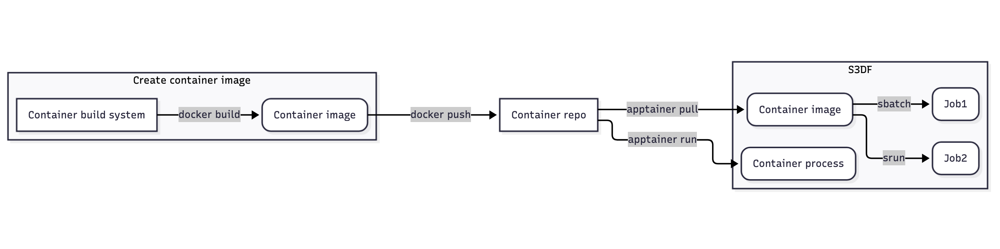

# Conda

[Conda](https://docs.conda.io/projects/conda/en/latest/index.html) and other Python package management tools such as [UV](https://docs.astral.sh/uv/) and [Poetry](https://python-poetry.org/) allow for easier installation and deployment of Python applications with complex dependencies. The following guide covers common usage patterns for Conda on S3DF.

## Conda Deployment Methods

### Facility installation of Miniconda

An S3DF facility (https://s3df.slac.stanford.edu/#/contact-us?id=poc) typically maintains software deployments relevant to its users under a path in that facility's group space, such as `/sdf/group/<facility>/sw`. The computing czar for a facility, and those they grant permissions to, can install/manage software such as Conda under that facility's group space.

Miniconda is a minimal distribution of Anaconda that contains Python, Conda, their dependencies, and some other useful packages. It is lightweight and has a smaller footprint than a full-fledged Conda or Anaconda deployment. Maintainers can download [Miniconda](https://docs.conda.io/en/latest/miniconda.html) and follow the [installation instructions](https://conda.io/projects/conda/en/latest/user-guide/install/linux.html#installing-on-linux) guide. The installation path can be overridden to point to an appropriate path under the facility group space as follows (replace `<facility>` with the name of the appropriate S3DF facility):

```bash
$ wget https://repo.anaconda.com/miniconda/Miniconda3-latest-Linux-x86_64.sh -O /tmp/Miniconda3-latest-Linux-x86_64.sh
$ bash /tmp/Miniconda3-latest-Linux-x86_64.sh -p /sdf/group/<facility>/sw/conda/
```

Users can add the newly-installed Conda binary to their `$PATH` environment variable by running:

```bash
$ export PATH=${PATH}:/sdf/group/<facility>/sw/conda/bin
```

## Conda Environments

The most common use case for Conda is to resolve and manage Python application dependencies. [Conda environments](https://docs.conda.io/projects/conda/en/latest/user-guide/tasks/manage-environments.html) allow Python applications to have their own installation environments isolated from each other, with the goal of reducing conflicts between applications that require different versions of the same packages. Users can invoke the environment that has the dependencies required for a specific Python application and run the application within that environment, in isolation from other applications.

Deploying Conda environments requires the following:
* Access to a `conda` binary executable
* Filesystem permissions to write to the directory where the Conda environment(s) will be stored
* Access (usually over the network) to any Python package repositories required (e.g., [the Python Package Index (PyPI)](https://pypi.org/) for the application
* Sufficient disk space in the env location to store the package artifacts

### Creating a Conda environment

Users can modify their individual Conda startup configuration file to set the default Python package channels, any packages, and override the default install path for new Conda envs, among other settings (for a complete list, see: https://conda.io/projects/conda/en/latest/user-guide/configuration/use-condarc.html). The following example configures Conda envs to:

* use the `defaults`, `anaconda`, `conda-forge`, and `pytorch` channels to access Python packages
* sets the environment to be installed under the `envs` directory of the facility's Conda instance
* sets the packages downloaded for environments to be installed under the `pkgs` directory of the facility's Conda instance
  
```bash
$ cat ~/.condarc
channels:
  - defaults
  - anaconda
  - conda-forge
  - pytorch
envs_dirs:
  - /sdf/group/<facility>/sw/conda/envs
pkgs_dirs:
  - /sdf/group/<facility>/sw/conda/pkgs
auto_activate_base: false
```

Conda environments can be created declaratively using YAML files (see: https://docs.conda.io/projects/conda/en/latest/user-guide/tasks/manage-environments.html#creating-an-environment-from-an-environment-yml-file).

The following YAML manifest generates a Conda environment called `mytest` with these packages and their dependencies pre-installed:

* `python=3.12` 
* `numpy`
* `pandas`
  
```bash
$ cat mytest-env.yaml
name: mytest
dependencies:
  - python=3.12
  - numpy
  - pandas
```

Create the Conda environment:
```
$ conda env create -f mytest-env.yaml
```

Once created, the `mytest` env should appear when listing Conda environments (`<facility>` is a placeholder): 
```
$ conda env list
# conda environments:
#
base          /sdf/group/<facility>/sw/conda 
mytest        /sdf/group/<facility>/sw/conda/envs/mytest
``` 

The Conda environment may be activated by running: 
```
$ conda activate mytest
```

Once the environment has been activated, the installed package list can be seen by running: 
```
(mytest) $ conda list
# packages in environment at /sdf/group/<facility>/sw/conda/envs/mytest:
#
# Name                    Version                   Build      Channel
[...]
numpy                     2.1.0           py312h58c1407_1      conda-forge
[...]
pandas                    2.2.2                    pypi_0      pypi
[...]
python                    3.12.5          h2ad013b_0_cpython   conda-forge
[...]
```
Note that the package list will show not only the pre-defined packages from the environment's YAML manifest, but any dependencies installed along with them.

Existing Conda environments can be exported into YAML manifests by running the following (change the name of the environment YAML file as desired):
```
$ conda env export > my-existing-env.yaml
```

> [!Note]
> Conda environments should not be stored in the user $HOME directory due to quota limits (30GB per user) and the inability to share the environment with other users. It is recommended to install Conda and other software into the appropriate facility group space (e.g., `/sdf/group/<facility>/sw` - please see [facility storage](getting-started.md#group)). To obtain proper filesystem permissions, please consult with the appropriate facility computing czar. The list of czars for S3DF facilities can be found at: https://coact.slac.stanford.edu/facilities.

## Containerizing Conda environments

Conda environments are designed to isolate a Python application and its dependencies. However, scientific applications frequently have a large number of heavyweight dependencies (e.g., `numpy` and `pandas`) that can utilize a large amount of disk space, as well as needing to be built against specific platforms and architectures for compatibility and performance. Additionally, re-deploying a Python application and its accompanying dependencies within a Conda environment to other systems (e.g., deploying the same application to SLAC and NERSC) can be time-consuming and lead to future maintenance issues as different deployments fall out of sync. Containerization (see: https://aws.amazon.com/what-is/containerization/) allows for the creation of an image that contains a full application stack all the way down to the operating system, which can be run on systems using a compatible container runtime such as `Docker`, `Podman`, `Apptainer`, etc. A Python application, with its accompanying Conda environment, Python packages, and the Conda installation itself, can be built into a container image. This can offer much more portability, especially when running applications in multiple high performance compute environments such as S3DF.

### Creating, Publishing, and Running Conda Container Images in S3DF

Container images can be built with a variety of tools in different container image formats, e.g. `Dockerfile`; it is recommended to use a format that conforms to the [Open Container Initiative (OCI)](https://opencontainers.org/) standard for portability and compatibility with the available userspace container runtime on S3DF ([Apptainer](https://apptainer.org/)). Docker images are supported by most container runtimes including Apptainer, thus allowing the container images to be used at multiple compute facilities.

Due to the fact that Docker's container build utility (e.g. `docker build...`) requires admin privileges on the host build system, users must create their Docker container images on a non-S3DF host where they have admin privileges (e.g. a work laptop with `sudo` privileges). Once built, the container image can be uploaded to an online container repository such as [GitHub Container Registry (ghcr.io)](https://docs.github.com/en/packages/working-with-a-github-packages-registry/working-with-the-container-registry) or [GitLab Container Registry](https://docs.gitlab.com/user/packages/container_registry/), then pulled onto S3DF interactive or batch nodes using the `apptainer` container runtime. The following diagram shows the development lifecycle for an application container used on S3DF:


> [!NOTE]
> The host system platform and architecture where a container image is built may differ from the platform and architecture where the container is run. For example, container images can be built on a MacOS or Windows host system, while S3DF batch nodes are currently running RHEL8/Rocky Linux 8 (and will eventually be migrated to Rocky Linux 9/10 and beyond). Docker and other container build tools can be configured to target different platforms and architectures, so ensure that the built container image is compatible with the target platform and architecture on S3DF nodes. For more information, see: https://docs.docker.com/build/building/multi-platform/.

The following example shows the workflow for creating a Conda environment in a Docker container image: Dockerfile to create a container image using a Miniconda base image and create a Conda environment in the image.

1. Create an example Conda environment using a YAML manifest:
```
name: test-env
channels:
  - default
  - conda-forge
dependencies:
  - python=3.9
  - bokeh=2.4.2
  - conda-forge::numpy=1.21.*
  - nodejs=16.13.*
  - flask
  - pip
  - pip:
    - Flask-Testing
```

2. Create an entrypoint script that will be run whenever the image is invoked by a container runtime:
```
#!/bin/bash --login

# The --login ensures the bash configuration is loaded,

# enabling Conda.

# Enable strict mode.
set -euo pipefail

# ... Run whatever commands ...
echo "bash ${MINIFORGE3_DIR}/etc/profile.d/conda.sh" >> ${HOME}/.bashrc
echo "conda init bash" >> ${HOME}/.bashrc

# Temporarily disable strict mode and activate conda:
set +euo pipefail
conda activate test-env

# Re-enable strict mode:
set -euo pipefail
```

3. Create a Dockerfile to copy the Conda environment manifest, create the Conda environment, and copy the entrypoint script into the container image
```
FROM continuumio/miniconda3:latest

WORKDIR /app

COPY test-env.yaml .

RUN conda env create -f /app/test-env.yaml && conda clean -afy

ENV PATH=/opt/conda/envs/test-env/bin:$PATH

COPY entrypoint.sh /entrypoint.sh

ENTRYPOINT ["/entrypoint.sh"]
```

4. On a build host with appropriate privileges, use the Docker runtime to build the image (replace `<username>` and `<repo>` placeholders as appropriate). For further details, see [https://docs.docker.com/get-started/docker-concepts/building-images/build-tag-and-publish-an-image/](https://docs.docker.com/get-started/docker-concepts/building-images/build-tag-and-publish-an-image/):
```
# '.' to build and tag an image using a Dockerfile in the current working directory
$ docker build -t <username>/<repo> .
```

5. Publish the image (may require authentication for private container repos. See: [https://docs.docker.com/get-started/docker-concepts/building-images/build-tag-and-publish-an-image/#publishing-images](https://docs.docker.com/get-started/docker-concepts/building-images/build-tag-and-publish-an-image/#publishing-images):
```
$ docker push <username>/<repo>
```

6. Pull the published image onto an S3DF [interactive](https://s3df.slac.stanford.edu/#/interactive-compute?id=interactive-pools) or [batch](https://s3df.slac.stanford.edu/#/interactive-compute?id=interactive-compute-session-using-slurm) node in a specified path with the Apptainer container runtime (see the [S3DF Apptainer Usage documentation](https://s3df.slac.stanford.edu/#/apptainer?id=apptainer)):

```
# On an S3DF interactive or batch node
$ apptainer pull </path/to>/test_img.sif docker://<username>/<repo> 
```

The Apptainer container image (`.sif`) can now be launched within an S3DF batch job or interactive batch session:
* Submit an S3DF batch job and load the Conda environment (see: [https://s3df.slac.stanford.edu/#/slurm?id=create-a-batch-script](https://s3df.slac.stanford.edu/#/slurm?id=create-a-batch-script)):
```
#!/bin/bash

#SBATCH --partition=ampere
#
#SBATCH --job-name=test
#SBATCH --output=output-%j.txt
#SBATCH --error=output-%j.txt
#
#SBATCH --ntasks=1
#SBATCH --cpus-per-task=12
#SBATCH --mem-per-cpu=1g
#
#SBATCH --time=0-00:10:00
#
#SBATCH --gpus 1

# invoke conda environment from container image
apptainer shell /path/to/test_img.sif

```
* Create an S3DF interactive batch session an invoke the Conda environment using  (see: [https://s3df.slac.stanford.edu/#/interactive-compute?id=interactive-compute-session-using-slurm](https://s3df.slac.stanford.edu/#/interactive-compute?id=interactive-compute-session-using-slurm)):

```
$ srun --partition <ada|ampere|milan|turing|torino> --account <facility>:<repo> -n 1 --time=01:00:00 --pty /bin/bash

# once the interactive session has been scheduled, invoke a shell into the container image to load the Conda environment
$ apptainer shell /path/to/test_img.sif
```
