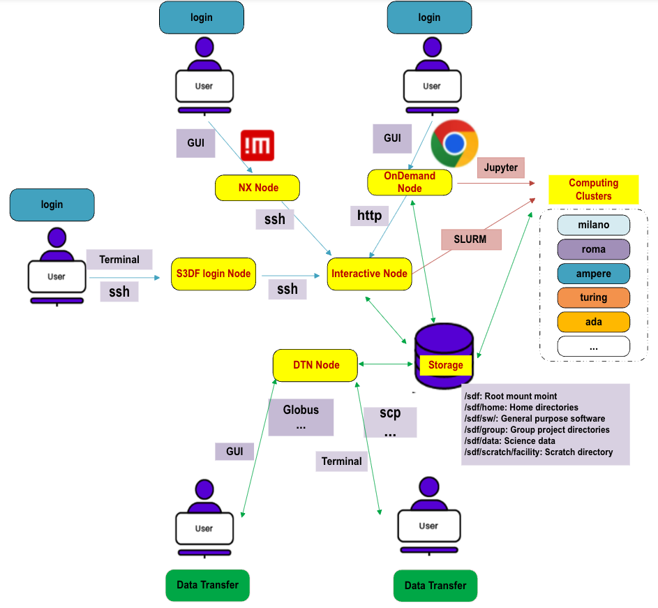

# Getting Started at S3DF

This document will guide you through the basics of using S3DF.

## Get a S3DF Account
To utilize the S3DF, you must first [acquire a S3DF account](accounts.md#account), and your user account should be associated with a S3DF Facility in [Coact](coact.md).

## Connect to S3DF
There are many ways to [access S3DF](access.md) depending upon your usage. You can [SSH](access.md#ssh), use the [NoMachine](access.md#nomachine) remote desktop, or [OnDemand](access.md#ondemand) web frontend.

## Computing Resources
S3DF offers three options for utilization
- [Interactive](interactive-compute.md): Commands that you issue are executed immediately.
- [Batch](batch-compute.md): Jobs are submitted to a queue and are executed as soon as resources become available.
- [Service](service-compute.md): Long-lived jobs that run in the background waiting for data to analyze.

## Manage Resources
Use our [Coact](coact.md) portal to manage compute resources, access permissions etc.

## Storage Resources
To ensure long-term consistency, the [S3DF directory structure](data-and-storage.md#directory) features immutable paths that are independent of the underlying file system organization and technology.

## Software
At S3DF, you will find a collection of [resources](software.md) provided by vendors, including compilers, HPC utilities, programming libraries, development tools, debuggers/profilers, and tools for data visualization. We utilize the `lmod` software catalog system.

## Data Transfers
- `s3dfdtn.slac.stanford.edu` serves as a load-balanced DNS name that directs users to a pool of dedicated data transfer nodes. This service is accessible to anyone with an S3DF account.
- For casual data transfers, common tools such as `scp` and `rsync` are available. If you require serious transfer of large volumes of data, we recommend using `bbcp` or `Globus`.
- For detailed information on performing data transfers within S3DF, please refer to the [data management guidelines](data-transfer.md).

## Overview of the S3DF facilities

## Getting Help
There are many resources available to assist you in utilizing S3DF effectively. The S3DF support team is always here to [help](contact-us.md) you with any questions or challenges you may encounter.
