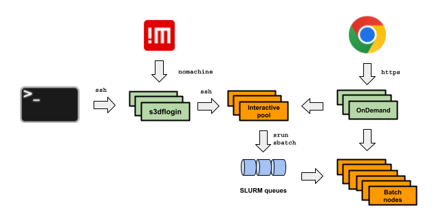

# Getting Started

## Modes of Operation

There are three different ways of utilizing S3DF:

1. [**Interactive**](interactive-compute.md): Commands that you issue are executed immediately. This is the most common approach for activities like building and debugging code, running simple analysis which require limited resources and/or require interaction with plots and logs. There are two modes for doing interactive work in S3DF: through a terminal, by opening a shell on one of the interactive pools, or through a browser, via OnDemand.

2. [**Batch**](batch-compute.md): Jobs are submitted to a queue and are executed as soon as resources become available. This is the most common approach for running large jobs or for executing many jobs. Note that this is the most efficient mechanism form a facility perspective because it provides the best use of the available resources. Also, note that, by far, the largest fraction of S3DF computing cycles is in the batch system. S3DF uses SLURM as workload manager for batch jobs.

3. [**Service**](service-compute.md): This approach is for running long-lived jobs that run in the background waiting for data to analyze. This method is for service activities and require specific resources. These resources may be dedicated hardware acquired by your organization or may be dynamically allocated from a larger pool. For the latter approach, S3DF uses Kubernetes, an open source framework for automating deployment, scaling, and management of containerized applications. 

Users can use SSH, NoMachine or a browser to log into the system. The login nodes are designed to do just that - to let you into the system. In order to actually analyze the data, you will need to access one of the [interactive pools](interactive-compute.md) or one of the [batch partitions](batch-compute.md).

## Do's and Don'ts

- Do [talk to us](contact-us.md) about your requirements.

- Don't perform any compute tasks on the login nodes as those are meant to operate only as bastion hosts, not for doing analysis or accessing data. 

- Don't perform compute intensive tasks on the interactive nodes, use the batch system instead. 

- Do be respectful of other users' jobs - you shall be sharing a limited set of nodes with many many other users. Please consider the type, size and quantity of jobs that you submit so that you do not starve others of compute resources. We do implement fair sharing to limit the impact upon others, however there are ways to game the system and your organization is charged time for the resources you utilize, see [batch banking](batch-compute.md#banking).

- Don't run interactive sessions on the batch system for a long time. Opening an interactive session on SLURM (using `srun --pty bash`) and not actually running any heavy processes can be wasteful of resources and could potentially be preventing others from doing their work. Consider using the interactive pools or OnDemand for these activities.

- Avoid keeping many (thousands to millions) of files in a single directory if possible - file systems typically do a lot better when you use a small number of large files.

- Do keep an eye on your file system [quotas](reference.md#storagequota) - your jobs will likely fail if it cannot write to disk due to a full quota. You can either choose a different file system to write to, or request a quota increase, or remove files you don't need anymore.

- Limit I/O intensive sessions where your jobs reads or writes a lot of data, or performs intensive meta data operations such as stat'ing many files or directories and opening and closing files in quick succession.

- Do test your jobs before launching many (potentially hundreds) of them for your actual analysis.

- Do request only the resources that you need. If you ask for more time or more CPUs or GPUs than you can actually use in your job, then it will take longer for your job to start, you will be reducing your fairshare so that your later jobs may be de-prioritised, and it prevents others from using potentially idle resources.

