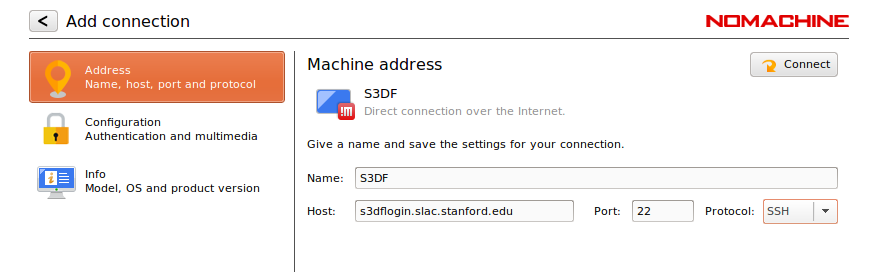
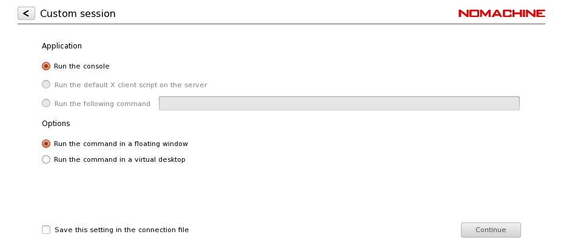

# Reference

## Common Tools

### NoMachine :nomachine

NoMachine is supported on Windows, MAC and Linux computers. You can get the latest version of the enterprise client from [NoMachine download page](https://www.nomachine.com/download-enterprise#NoMachine-Enterprise-Client). Ubuntu/Mint users should download the Debian version (DEB) of the NoMachine client. MAC Clients must install XCode and XQuartz.

In order to access S3DF, host is set to s3dfnx.slac.stanford.edu, port to 22, and protocol to SSH. See the snapshots below for standard NoMachine settings for S3DF usage.




### OnDemand :ondemand

[Open OnDemand](https://openondemand.org/) is a web-based terminal. As long as you keep your web browser open, or are not using your browsers private browsing feature, you should only need to authenticate again about once a day. 

?> __TODO__ more about module avail etc.

We also provide common compilation tools...

?> __TODO__ describe compilation tools etc.


## FAQ :faq

### How do I check current status of storage quotas? :id=storagequota

You might want to know how much of your quota is used; reaching the
limit might be the cause of error messages whose reason is not
obvious. To do so for your home, simply type `df -h ~/` in a terminal
window. More in general type `df -h <folder>` to determine the quota
for any folder.


### How do I access AFS/GPFS/Lustre? :id=legacyfs

The SLAC-wide legacy file systems AFS, GPFS, and SDF Lustre will be
mounted read-only, and only on the interactive pools, to enable the
migration of legacy data to S3DF storage:

- AFS: `/fs/afs` The current plan is to use the afsnfs translator
  since AFS ACLs do not map to POSIX anyway.  Some experimentation is
  underway to see what issues might exist in any potential transfer to
  S3DF.

- GPFS: `/fs/gpfs` The current plan is to use NFS as the access
  method.  Affected systems: ACD, ATLAS, CryoEM, DES + DarkSky, Fermi,
  KIPAC, LSSTcam, MCC/EED, StaaS.

- Lustre: `/fs/ddn`  Although Lustre is currently operating in
  read-write mode, groups will likely benefit from moving data to S3DF
  storage as it becomes available to them.


### How are my files backed up? :id=backup

Current backup/archive situation

| File system | Snapshot | Tape backup (TSM) | Tape archive (HPSS) | Done by | Paid by |
| --- | --- | --- | --- | --- | --- |
| sdfhome | To flash | Yes | No | S3DF | SLAC |
| sdfscratch | No | No | No | - | - |
| sdfk8s | To flash | No | No | S3DF | SLAC |
| sdfdata | No | On demand | Active, from files | S3DF | SLAC |
| sdfdata:/u | No | On demand | No | S3DF | Group |
| S3 direct | No | No | No | No | No | 


Target backup/archive strategy

| File system | Snapshot | Tape backup (TSM-like) | Tape archive (HPSS-like) | Done by | Paid by |
| --- | --- | --- | --- | --- | --- |
| sdfhome | To S3 bucket | No | From S3 snapshots | S3DF | SLAC | 
| sdfscratch | No | No | No | - | - |
| sdfk8s | To S3 bucket | No | From S3 snapshots | S3DF | SLAC |
| sdfdata | No | No | Active, from files | Group | Group |
| sdfdata:/u | To S3 bucket | No | From S3 snapshots | S3DF | Group |
| S3 direct | No | No | From S3 | Group | Group | 

?> sdfdata:/u indicates folders that logically belong to sdfgroup but
are too large to be paid for by SLAC.

?> The target backup strategy is aspirational, we need to find the
right tools to copy from S3 to tape.


### May I Contribute to the S3DF Documentation? :id=docsify

Please feel free to send us suggestions and modifications to this documentation! The content is hosted on [github](https://github.com/slaclab/sdf-docs) and as long as you have a github account, you can send us [pull request](https://docs.github.com/en/github/collaborating-with-issues-and-pull-requests/creating-a-pull-request) where we can review your changes and merge them into this site.

?> __TIP__ At the top of each page, there is also a 'Edit Page' button that will send you directly to the page on github to be edited

The documentation uses [docsify.js](https://docsify.js.org/) to render [markdown](https://www.markdownguide.org/) documents into a static website using only javascript. Whilst not necessary to submit changes, you may want to view the webpage locally for development purposes. Once you have cloned this document repository, you can start a local web server to preview all changes. Please see [docsify](https://docsify.js.org/#/quickstart) for more details.


## Slurm FAQ :SlurmFAQ

The official Slurm documentation can be found at the [SchedMD
site](https://slurm.schedmd.com/documentation.html).

### Why should I use Batch?

Whilst your desktop or laptop computer has a fast processor and quick access to data stored on its local hard disk/ssd; you may want to run large compute tasks that require more CPU/GPU/memory to run, or to process a large amount of data. Our compute servers are part of a Batch system that allows you to accomplish such tasks in a reasonable amount of time. Our servers also have fast access to centralised storage, have widely-used, common software packages and images pre-installed, and will enable you to run these larger compute tasks without impacting your own local desktop/laptop resources.

### Why should I use Slurm?

Historically, SLAC has used IBM's LSF as our Batch scheduler software. However, with the addition of new hardware such as our NVIDIA GPUs, we have decided to switch to Slurm to schedule compute jobs as it is also commonly used across other academic and laboratory environments. We hope that this commonality and consistency with other facilities will enable easier usage for users, as well as simpler administration for the Science Computing team here at SLAC.

### What should I know about using Batch?

The purpose of a batch system is to enable efficient sharing of the CPUs, GPUs, memory, and ephemeral storage that exists in a compute Cluster. The cluster is comprised of many servers - often called batch nodes. As the number of these batch nodes and their resources (such as GPUs) in our environment is finite, we need to keep account of which users consume which resources so that we can provide access to all users in a fair manner. 

### What is a Slurm Partition? :id=partition

A partition is a logical grouping of batch nodes. These are servers of a similar technical specification (eg Cascade Lake CPUs, Telsa GPUs etc). Examples of partition names are roma and milano.


### How do I See the Status of the available resources?

To view the status of the nodes on SDF from the command line use [sinfo](https://slurm.schedmd.com/sinfo.html).  The following produces a reasonably informative summary of all the nodes on SDF:

```
sinfo --Node --format="%10N %.6D %10P %10T %20E %.4c %.8z %8O %.6m %10e %.6w %.60f"
```

To get only information on a specific partition use ```--partition=<partition>```. To get more information on a specfic node, use the following [scontrol](https://slurm.schedmd.com/scontrol.html) command:

```
scontrol show node <node name>
```

The names of the nodes can be found in the left-most column of the above sinfo command (called NODELIST) for some reason.


### How do I use Slurm? :id=slurmexample

There are two ways to interact with slurm

- Using command line tools on the interactive pools.
- Using the ondemand web interface.

Common actions that you may want to perform are:

| | | |
|--- |--- |--- |
| Submit a job | `srun` or `sbatch` | request a quick job to be ran - eg an interactive terminal for `srun` and a longer job(s) with `sbatch` |
| Show information about a job | `scontrol show job <jobid>` | shows detailed information about the state, resources requested etc. for a job |
| Cancel or terminate a job | `scancel <jobid>` | cancel a job; you can also use --signal=INT to send a unix signal to the job to cleanly terminate |
| Show position in squeue | `sprio` | shows the fairshare calculations that determine your place in line for the job to start |
| Show running statistics about a job | `sstat`	| show job usage details |
| Modify accout/add users to partitions etc. | `sacctmgr` | manage Associations |


### How do I submit a Batch Job?

In order to submit a batch job, you have to:

1. [create a text file containing some slurm commands](#create-batch-script) (lines starting with `#SBATCH`) and a list of commands/programs that you wish to run. This is called a batch script.
2. [submit this batch script](#submit-batch-script)  to the cluster using the `sbatch` command
3. [monitor the job](#monitor-job) using `scontrol show job`

#### Create a Batch Script :id=create-batch-script

Create a job submission script (text file) `script.sh` (or whatever filename you wish):

```
#!/bin/bash
 
#SBATCH --partition=shared
#
#SBATCH --job-name=test
#SBATCH --output=output-%j.txt
#SBATCH --error=output-%j.txt
#
#SBATCH --ntasks=1
#SBATCH --cpus-per-task=12
#SBATCH --mem-per-cpu=1g
#
#SBATCH --time=0-00:10:00
#
#SBATCH --gpus 1
 
<commands here>

```

In the above example, we write a batch script for a job named 'test' (using the `--job-name`). You can choose what ever name you wish to give the job so that you may be able to quickly identify it yourself. Both stdout and stderr will be outputted the same file `output-%j.txt` in the current working working - %j will be replaced with the slurm job id (using the `--output` and `--error` options). We request a single Task (think of it as an MPI rank) and that single task will request 12 CPUs; each of which will be allocated 1GB of RAM - so a total of 12GB. By default, the `--ntasks` will be equivalent to the number of nodes (servers) asked for. In order to aid scheduling (and potentially prioritising the Job), we limit the [duration of the Job](#time) to 10 minutes. The format of the time limit field is `D-HH:MM:SS`. We also request a single [GPU](#using-gpus) with the Job. This will be exposed via CUDA_VISIBLE_DEVICES.

?> __TIP:__ only lines starting with `#SBATCH ` will be processed by the slurm interpretor. As the script itself is just a bash script, any line beginning with `#` will be ignored. As such you may also comment out slurm directives by using somethign like `##SBATCH`

We can define [where the job will run](#partition) using the `--partition` option. 

?> You can think of the batch script as a shell script but with some extra directives that only slurm understand. As such, you can also just run the same script in hte command line to ensure that your job will work; ie `sh script.sh` will run the same set of commands but on the local host. This therefore also means that if you already have a shell script that runs your code, you can 'slurmify' it by adding slurm directives with `#SBATCH`. Please note, however, that if you are using GPUs in your code etc. the login node may not have any GPUs and hence your local run will fail.

?> add something about submitting sbatch commands directy without using a batch script - ie `--wrap`


##### Specifying how long the job should run for :id=time

It is important that you specify a meaningful duration for which your expect your job to run for. This allows the slurm scheduler to appropriately priortize your job against other jobs that are competing for the limited resources in the cluster. The duration of a job may depend upon many different factors such as the type of hardware that you may be constraining your job to run against, how well your code/application scales with multiple nodes, the speed of memory and disk access etc. etc.

You can specify the expected duration with the `--time` option. Valid time formats are:

```
M (M minutes)
M:S (M minutes, S seconds)
H:M:S (H hours, M minutes, S seconds)
D-H (D days, H hours)
D-H:M (D days, H hours, M minutes)
D-H:M:S (D days, H hours, M minutes, S seconds)
```

Once the job exceeds the specified job time, it will terminate. Unless you checkpoint your application as it progresses this may result in wasted cycles and the need to submit the job again with a longer duration.


##### Specifying CPU requirements :id=cpu

!> __TODO__

##### Specifying memory requirements :id=memory

!> __TODO__

##### Specifying nodes with specific resources (constraints) :id=constraints

!> __TODO__

##### Specifying local scratch space :id=scratch

!> __TODO__

##### Notification of job status :id=notification

##### Changing the working directory :id=workingdir

!> diff between cd'ing on the script and `--workingdir`

##### Specifying a reservation :id=reservation


#### Submit the job :id=submit-batch-script

?> note stuff about workign directories etc.

After you have [created a batch script](#create-batch-script), you then need to tell slurm to queue it so that it may run. The command to you is `sbatch` and is synonymous with the `bsub` command in LSF. Therfore to submit the script `script.sh` we simply run

```
sbatch script.sh
```

If successful, it should provide you with the job id that the script will run as. You can use this job id to [monitor your job progress](#monitor-job).

?> __TIP:__ you can also submit the slurm directives directly on the command line rather than within the batch script. When submitted as arguments to `srun` or `sbatch`, they will take precedence over any same directives that may already be specified in the batch script. e.g. if you run `sbatch --partition ml script.sh` and your script.sh contains a definiting to use the shared partition, your job will be submitted into the ml partition.


#### Monitor job progress :id=monitor-job


You can then use the command to monitor your job progress

```
squeue
```

And you can cancel the job with

```
scancel <jobid>
```

###  How can I request GPUs?

You can use the `--gpus` to specify gpus for your jobs: Using a number will request the number of any gpu that is available (what you get depends upon what your Account/Association is and what is available when you request it). You can also specify the type of gpus by prefixing the number with the model name. eg

```
# request single gpu
srun -A shared -p shared -n 1 --gpus 1 --pty /bin/bash
 
# request a gtx 1080 gpu
srun -A shared -p shared -n 1 --gpus geforce_gtx_1080_ti:1 --pty /bin/bash
 
# request a gtx 2080 gpu
srun -A shared -p shared -n 1 --gpus geforce_rtx_2080_ti:1 --pty /bin/bash
 
# request a v100 gpu
srun -A shared -p shared -n 1 --gpus v100:1 --pty /bin/bash
```

### How can I see what GPUs are available?

```
# sinfo -o "%12P %5D %14F %7z %7m %10d %11l %42G %38N %f"
PARTITION    NODES NODES(A/I/O/T) S:C:T   MEMORY  TMP_DISK   TIMELIMIT   GRES                                       NODELIST                               AVAIL_FEATURES
shared*      1     0/1/0/1        2:8:2   191567  0          7-00:00:00  gpu:v100:4                                 nu-gpu02                               CPU_GEN:SKX,CPU_SKU:4110,CPU_FRQ:2.10GHz,GPU_GEN:VLT,GPU_SKU:V100,GPU_MEM:32GB,GPU_CC:7.0
shared*      8     0/1/7/8        2:12:2  257336  0          7-00:00:00  gpu:geforce_gtx_1080_ti:10                 cryoem-gpu[02-09]                      CPU_GEN:HSW,CPU_SKU:E5-2670v3,CPU_FRQ:2.30GHz,GPU_GEN:PSC,GPU_SKU:GTX1080TI,GPU_MEM:11GB,GPU_CC:6.1
shared*      14    0/0/14/14      2:12:2  191552  0          7-00:00:00  gpu:geforce_rtx_2080_ti:10                 cryoem-gpu[11-15],ml-gpu[02-10]        CPU_GEN:SKX,CPU_SKU:5118,CPU_FRQ:2.30GHz,GPU_GEN:TUR,GPU_SKU:RTX2080TI,GPU_MEM:11GB,GPU_CC:7.5
shared*      1     0/1/0/1        2:12:2  257336  0          7-00:00:00  gpu:geforce_gtx_1080_ti:10(S:0)            cryoem-gpu01                           CPU_GEN:HSW,CPU_SKU:E5-2670v3,CPU_FRQ:2.30GHz,GPU_GEN:PSC,GPU_SKU:GTX1080TI,GPU_MEM:11GB,GPU_CC:6.1
shared*      3     0/3/0/3        2:12:2  191552  0          7-00:00:00  gpu:geforce_rtx_2080_ti:10(S:0)            cryoem-gpu10,ml-gpu[01,11]             CPU_GEN:SKX,CPU_SKU:5118,CPU_FRQ:2.30GHz,GPU_GEN:TUR,GPU_SKU:RTX2080TI,GPU_MEM:11GB,GPU_CC:7.5
shared*      3     0/3/0/3        2:8:2   191567  0          7-00:00:00  gpu:v100:4(S:0-1)                          cryoem-gpu50,nu-gpu[01,03]             CPU_GEN:SKX,CPU_SKU:4110,CPU_FRQ:2.10GHz,GPU_GEN:VLT,GPU_SKU:V100,GPU_MEM:32GB,GPU_CC:7.0
shared*      1     0/1/0/1        2:12:2  257330  0          7-00:00:00  gpu:geforce_gtx_1080_ti:8(S:0),gpu:titan_x hep-gpu01                              CPU_GEN:HSW,CPU_SKU:E5-2670v3,CPU_FRQ:2.30GHz,GPU_GEN:PSC,GPU_SKU:GTX1080TI,GPU_MEM:11GB,GPU_CC:6.1
ml           9     0/0/9/9        2:12:2  191552  0          infinite    gpu:geforce_rtx_2080_ti:10                 ml-gpu[02-10]                          CPU_GEN:SKX,CPU_SKU:5118,CPU_FRQ:2.30GHz,GPU_GEN:TUR,GPU_SKU:RTX2080TI,GPU_MEM:11GB,GPU_CC:7.5
ml           2     0/2/0/2        2:12:2  191552  0          infinite    gpu:geforce_rtx_2080_ti:10(S:0)            ml-gpu[01,11]                          CPU_GEN:SKX,CPU_SKU:5118,CPU_FRQ:2.30GHz,GPU_GEN:TUR,GPU_SKU:RTX2080TI,GPU_MEM:11GB,GPU_CC:7.5
neutrino     1     0/1/0/1        2:8:2   191567  0          infinite    gpu:v100:4                                 nu-gpu02                               CPU_GEN:SKX,CPU_SKU:4110,CPU_FRQ:2.10GHz,GPU_GEN:VLT,GPU_SKU:V100,GPU_MEM:32GB,GPU_CC:7.0
neutrino     2     0/2/0/2        2:8:2   191567  0          infinite    gpu:v100:4(S:0-1)                          nu-gpu[01,03]                          CPU_GEN:SKX,CPU_SKU:4110,CPU_FRQ:2.10GHz,GPU_GEN:VLT,GPU_SKU:V100,GPU_MEM:32GB,GPU_CC:7.0
cryoem       8     0/1/7/8        2:12:2  257336  0          infinite    gpu:geforce_gtx_1080_ti:10                 cryoem-gpu[02-09]                      CPU_GEN:HSW,CPU_SKU:E5-2670v3,CPU_FRQ:2.30GHz,GPU_GEN:PSC,GPU_SKU:GTX1080TI,GPU_MEM:11GB,GPU_CC:6.1
cryoem       5     0/0/5/5        2:12:2  191552  0          infinite    gpu:geforce_rtx_2080_ti:10                 cryoem-gpu[11-15]                      CPU_GEN:SKX,CPU_SKU:5118,CPU_FRQ:2.30GHz,GPU_GEN:TUR,GPU_SKU:RTX2080TI,GPU_MEM:11GB,GPU_CC:7.5
cryoem       1     0/1/0/1        2:12:2  257336  0          infinite    gpu:geforce_gtx_1080_ti:10(S:0)            cryoem-gpu01                           CPU_GEN:HSW,CPU_SKU:E5-2670v3,CPU_FRQ:2.30GHz,GPU_GEN:PSC,GPU_SKU:GTX1080TI,GPU_MEM:11GB,GPU_CC:6.1
cryoem       1     0/1/0/1        2:12:2  191552  0          infinite    gpu:geforce_rtx_2080_ti:10(S:0)            cryoem-gpu10                           CPU_GEN:SKX,CPU_SKU:5118,CPU_FRQ:2.30GHz,GPU_GEN:TUR,GPU_SKU:RTX2080TI,GPU_MEM:11GB,GPU_CC:7.5
cryoem       1     0/1/0/1        2:8:2   191567  0          infinite    gpu:v100:4(S:0-1)

```


### Why is My Job taking a long time to start?

This is often due to limited resources. The simplest way is to request less CPU (`--cpus`) or less memory (`--mem`for your Job. However, this will also likely increase the amount of time that you need for the Job to complete. Note that perfect scaling is often very difficult (ie using 16 CPUs will not run twice as fast as 8 CPUs, as will using 4 nodes via MPI will not run twice as fast as 2 nodes), so it may be beneficial to submit many smaller Jobs if your code allows it. You can also set the `--time` option to specify that your job will only run upto that amount of time so that the scheduler can better fit your job in.

You can also make use of the Scavenger QoS such that your job may run on any available resources available at SLAC. This, however, has the disadvantage that should higher priority jobs run on the same resources, your jobs may be terminated (preempted) - possibly before it has completed.


## Common Software

### Singularity

For a detailed explanation of how to use Singularity on SDF, you can go through Yee-Ting Li's presentation [here](https://confluence.slac.stanford.edu/display/AI/AI+Seminar#AISeminar-Containers!Containers!Containers!) where you can find both the slides and the zoom recording.

#### Prerequisite

As pulling and building a new image can use quite a lot of disk space, we recommend that you set the appropriate cache paths for singularity to not use your $HOME directory. Therefore, before pulling or building an image, define the following environment variables:

```bash
export DIR=/scratch/${USER}/.singularity
mkdir $DIR -p
export SINGULARITY_LOCALCACHEDIR=$DIR
export SINGULARITY_CACHEDIR=$DIR
export SINGULARITY_TMPDIR=$DIR
```

#### Pulling images

To pull an image from DockerHub, do:
```bash
singularity pull docker://<user or organization>/<repository>:<tag>
```


### GCC Compiler

We offer various of GCC through (Redhat Software Collections](https://developers.redhat.com/products/softwarecollections/overview). These are wrapped up in [Environment Modules](#modulefiles) and are available with a `module load devtoolset/<version>`.

We also provide symlinks to the appropriate GCC version to the above `devtoolset` packages with `module load gcc/<version>`.


### Jupyter

We provide tunnel-less access to jupyter instances running on SDF via an easy to use web portal where you can 'bring-your-own' jupyter environments. See [Interactive Jupyter](interactive-compute.md#jupyter) for more information.

### MatLab

This section describes how to run Matab in the S3DF Parallel Computing
environment.  You can bring up matlab interactively on your
desktop/laptop with nomachine or in an interactive slurm session with srun,
submit jobs from within matlab, or submit jobs using sbatch from a job submission node.
If you are going to use slurm, you will need to configure matlab for your account
following instructions included below.


#### Using NoMachine

Install and configure nomachine on your system:
```
https://s3df.slac.stanford.edu/public/doc/#/reference?id=nomachine
https://confluence.slac.stanford.edu/display/SCSPub/NoMachine

Bring up nomachine, ssh to a  submission host and issue:

module load matlab
matlab
```

#### Interactively using srun
```
ssh -X <batch submission host>
srun --x11 -A <account> -p <partition> -n 1 --pty /bin/bash
module load matlab
matlab
```


#### How to set up your matlab configuration for slurm job submission

You will need to have access
to a slurm account and a partition in order to submit jobs.  Bring up
matlab,
```
module load matlab
matlab
```

Once in the matlab environment run the following commands:
```
configCluster
c = parcluster
c.AdditionalProperties.AccountName = '<name of account>'
c.AdditionalProperties.QueueName = '<name of partition>'
c.saveProfile
```
These steps will create a .matlab/3p_cluster_jobs directory under your account with
our site¿s configuration and you can submit jobs which will run on the
partition and account specified.


#### Submitting matlab jobs with sbatch

You will need access to an account and a partition to
submit matlab jobs with slurm, and you will have to
configure matlab as described above.  Below are two
examples of batch submission scripts to run matlab.

##### Example sbatch single node submission

```
#!/bin/sh

#SBATCH --partition=roma
#SBATCH --account=rubin
#SBATCH -n 1                            # 1 instance of MATLAB
#SBATCH --cpus-per-task=8               # 8 cores per instance
#SBATCH --mem-per-cpu=4gb               # 4 GB RAM per core
#SBATCH --time=00:30:00                 # 10 minutes

# Add MATLAB to system path
module load matlab

# Run code 
matlab -batch calc_pi
```

This is the sample calc_pi.m matlab job used in the above submission:

```
function calc_pi

c = parcluster('local');

% Query for available cores (assume either Slurm or PBS)
sz = str2num([getenv('SLURM_CPUS_PER_TASK') getenv('PBS_NP')]); %#ok<ST2NM>
if isempty(sz), sz = maxNumCompThreads; end

if isempty(gcp('nocreate')), c.parpool(sz); end

spmd
    a = (labindex - 1)/numlabs;
    b = labindex/numlabs;
    fprintf('Subinterval: [%-4g, %-4g]\n', a, b)

    myIntegral = integral(@quadpi, a, b);
    fprintf('Subinterval: [%-4g, %-4g]   Integral: %4g\n', a, b, myIntegral)

    piApprox = gplus(myIntegral);
end

approx1 = piApprox{1};  % 1st element holds value on worker 1
fprintf('pi           : %.18f\n', pi)
fprintf('Approximation: %.18f\n', approx1)
fprintf('Error        : %g\n',    abs(pi - approx1))


function y = quadpi(x)
%QUADPI Return data to approximate pi.

% Derivative of 4*atan(x)
y = 4./(1 + x.^2);
```

The job would look like this in the slurm queue:
```
[renata@sdfrome001 examples]$ squeue -u renata
             JOBID PARTITION     NAME     USER ST       TIME  NODES NODELIST(REASON)
           1155746      roma matlab-s   renata  R       0:10      1 sdfrome027
```

and the output should look like:
```
Starting parallel pool (parpool) using the 'Processes' profile ...
Connected to the parallel pool (number of workers: 8).
Worker 1: 
  Subinterval: [0   , 0.125]
  Subinterval: [0   , 0.125]   Integral: 0.49742
Worker 2: 
  Subinterval: [0.125, 0.25]
  Subinterval: [0.125, 0.25]   Integral: 0.482495
Worker 3: 
  Subinterval: [0.25, 0.375]
  Subinterval: [0.25, 0.375]   Integral: 0.455168
Worker 4: 
  Subinterval: [0.375, 0.5 ]
  Subinterval: [0.375, 0.5 ]   Integral: 0.419508
Worker 5: 
  Subinterval: [0.5 , 0.625]
  Subinterval: [0.5 , 0.625]   Integral: 0.379807
Worker 6: 
  Subinterval: [0.625, 0.75]
  Subinterval: [0.625, 0.75]   Integral: 0.339607
Worker 7: 
  Subinterval: [0.75, 0.875]
  Subinterval: [0.75, 0.875]   Integral: 0.301316
Worker 8: 
  Subinterval: [0.875, 1   ]
  Subinterval: [0.875, 1   ]   Integral: 0.266273
pi           : 3.141592653589793116
Approximation: 3.141592653589792672
Error        : 4.44089e-16
```


##### Example sbatch multi-node  submission
In this case you would
see 2 slurm jobs, one just to bring up matlab and the other to run the job:
```
[renata@sdfrome001 examples]$ squeue -u renata
             JOBID PARTITION     NAME     USER ST       TIME  NODES NODELIST(REASON)
           1156422      roma    Job15   renata  R       0:12      1 sdfrome028
           1156401      roma matlab-m   renata  R       0:49      1 sdfrome028
```
This is the slurm submission job:
```
#!/bin/sh

#SBATCH --partition=roma
#SBATCH --account=rubin
#SBATCH -n 1                            # 1 instance of MATLAB
#SBATCH --cpus-per-task=1               # 1 core per instance
#SBATCH --mem-per-cpu=4gb               # 4 GB RAM per core
#SBATCH --time=00:20:00                 # 20 minutes

# Add MATLAB to system path
module load matlab

# Run code 
matlab -batch calc_pi_multi_node
```

And this is the matlab job, calc_pi_multi_node.m used in the above script:
```
function calc_pi_multi_node

c = parcluster;

% Required fields
c.AdditionalProperties.WallTime = '00:20:00';


if isempty(gcp('nocreate')), c.parpool(20); end

spmd
    a = (labindex - 1)/numlabs;
    b = labindex/numlabs;
    fprintf('Subinterval: [%-4g, %-4g]\n', a, b)

    myIntegral = integral(@quadpi, a, b);
    fprintf('Subinterval: [%-4g, %-4g]   Integral: %4g\n', a, b, myIntegral)

    piApprox = gplus(myIntegral);
end

approx1 = piApprox{1};  % 1st element holds value on worker 1
fprintf('pi           : %.18f\n', pi)
fprintf('Approximation: %.18f\n', approx1)
fprintf('Error        : %g\n',    abs(pi - approx1))


function y = quadpi(x)
%QUADPI Return data to approximate pi.

% Derivative of 4*atan(x)
y = 4./(1 + x.^2);
```

The output should look like:
```
Starting parallel pool (parpool) using the 's3df R2022b' profile ...

additionalSubmitArgs =

    '--ntasks=20 --cpus-per-task=1 --ntasks-per-core=1 -A rubin --mem-per-cpu=4gb -p roma -t 00:20:00'

Connected to the parallel pool (number of workers: 20).
Worker  1: 
  Subinterval: [0   , 0.05]
  Subinterval: [0   , 0.05]   Integral: 0.199834
Worker  2: 
  Subinterval: [0.05, 0.1 ]
  Subinterval: [0.05, 0.1 ]   Integral: 0.198841
Worker  3: 
  Subinterval: [0.1 , 0.15]
  Subinterval: [0.1 , 0.15]   Integral: 0.196885
Worker  4: 
  Subinterval: [0.15, 0.2 ]
  Subinterval: [0.15, 0.2 ]   Integral: 0.194022
Worker  5: 
  Subinterval: [0.2 , 0.25]
  Subinterval: [0.2 , 0.25]   Integral: 0.190332
Worker  6: 
  Subinterval: [0.25, 0.3 ]
  Subinterval: [0.25, 0.3 ]   Integral: 0.185913
Worker  7: 
  Subinterval: [0.3 , 0.35]
  Subinterval: [0.3 , 0.35]   Integral: 0.180872
Worker  8: 
  Subinterval: [0.35, 0.4 ]
  Subinterval: [0.35, 0.4 ]   Integral: 0.175326
Worker  9: 
  Subinterval: [0.4 , 0.45]
  Subinterval: [0.4 , 0.45]   Integral: 0.16939
Worker 10: 
  Subinterval: [0.45, 0.5 ]
  Subinterval: [0.45, 0.5 ]   Integral: 0.163175
Worker 11: 
  Subinterval: [0.5 , 0.55]
  Subinterval: [0.5 , 0.55]   Integral: 0.156782
Worker 12: 
  Subinterval: [0.55, 0.6 ]
  Subinterval: [0.55, 0.6 ]   Integral: 0.150305
Worker 13: 
  Subinterval: [0.6 , 0.65]
  Subinterval: [0.6 , 0.65]   Integral: 0.143823
Worker 14: 
  Subinterval: [0.65, 0.7 ]
  Subinterval: [0.65, 0.7 ]   Integral: 0.137403
Worker 15: 
  Subinterval: [0.7 , 0.75]
  Subinterval: [0.7 , 0.75]   Integral: 0.131101
Worker 16: 
  Subinterval: [0.75, 0.8 ]
  Subinterval: [0.75, 0.8 ]   Integral: 0.124959
Worker 17: 
  Subinterval: [0.8 , 0.85]
  Subinterval: [0.8 , 0.85]   Integral: 0.119012
Worker 18: 
  Subinterval: [0.85, 0.9 ]
  Subinterval: [0.85, 0.9 ]   Integral: 0.113284
Worker 19: 
  Subinterval: [0.9 , 0.95]
  Subinterval: [0.9 , 0.95]   Integral: 0.107791
Worker 20: 
  Subinterval: [0.95, 1   ]
  Subinterval: [0.95, 1   ]   Integral: 0.102542
pi           : 3.141592653589793116
Approximation: 3.141592653589793116
Error        : 0
```

#### Submitting slurm jobs from inside matlab

You will need to have done the configuration steps shown above and
have access to an account and partition in slurm in order to be able
to submit jobs from within a matlab session.  Following is a log of
a session that runs the example batch script "j=batch(c,@pwd,1,{})"
from within a matlab interactive session:

```

[renata@sdfrome001 ~]$ module load matlab
[renata@sdfrome001 ~]$ matlab
MATLAB is selecting SOFTWARE OPENGL rendering.

                                                           < M A T L A B (R) >
                                                 Copyright 1984-2022 The MathWorks, Inc.
                                            R2022b Update 1 (9.13.0.2080170) 64-bit (glnxa64)
                                                            September 28, 2022

 
To get started, type doc.
For product information, visit www.mathworks.com.
 
>> c = parcluster

c = 

 Generic Cluster

    Properties: 

                   Profile: s3df R2022b
                  Modified: false
                      Host: sdfrome001.sdf.slac.stanford.edu
                NumWorkers: 100000
                NumThreads: 1

        JobStorageLocation: /sdf/home/r/renata/.matlab/3p_cluster_jobs/s3df/R2022b/shared
         ClusterMatlabRoot: /sdf/sw/matlab/R2022b
           OperatingSystem: unix

   RequiresOnlineLicensing: false
     PluginScriptsLocation: /sdf/sw/matlab/R2022b/toolbox/local/IntegrationScripts/s3df
      AdditionalProperties: List properties

    Associated Jobs: 

            Number Pending: 0
             Number Queued: 0
            Number Running: 9
           Number Finished: 3

>> c.AdditionalProperties

ans = 

  AdditionalProperties with properties:

             AccountName: 'rubin'
    AdditionalSubmitArgs: ''
              Constraint: ''
            EmailAddress: ''
             EnableDebug: 0
                MemUsage: '4gb'
            ProcsPerNode: 0
               QueueName: 'roma'
    RequireExclusiveNode: 0
             Reservation: ''
                 UseSmpd: 0
                WallTime: ''

>>  
>> 
>> j=batch(c,@pwd,1,{}) 

additionalSubmitArgs =

    '--ntasks=1 --cpus-per-task=1 --ntasks-per-core=1 -A rubin --mem-per-cpu=4gb -p roma'


j = 

 Job

    Properties: 

                   ID: 16
                 Type: independent
             Username: renata
                State: queued
       SubmitDateTime: 23-Nov-2022 07:25:43
        StartDateTime: 
      RunningDuration: 0 days 0h 0m 0s
           NumThreads: 1

      AutoAttachFiles: true
  Auto Attached Files: {}
        AttachedFiles: {}
    AutoAddClientPath: true
      AdditionalPaths: /sdf/home/r/renata/matlab
            FileStore: [1x1 parallel.FileStore]
           ValueStore: [1x1 parallel.ValueStore]
 EnvironmentVariables: {}

    Associated Tasks: 

       Number Pending: 1
       Number Running: 0
      Number Finished: 0
    Task ID of Errors: []
  Task ID of Warnings: []
   Task Scheduler IDs: 1184718

>> 
>> 
>> j.fetchOutputs

ans =

  1x1 cell array

    {'/sdf/home/r/renata'}

```


#### Links to more information about MATLAB

Parallel computing documentation:
https://www.mathworks.com/help/parallel-computing/index.html

Parallel computing coding examples:
https://www.mathworks.com/products/parallel-computing.html

Parallel computing tutorials:
https://www.mathworks.com/videos/series/parallel-and-gpu-computing-tutorials-97719.html

Parallel computing videos:
https://www.mathworks.com/videos/search.html?q=&fq[]=product:DM&page=1

Parallel computing webinars:
https://www.mathworks.com/videos/search.html?q=&fq[]=product:DM&fq[]=video-external-category:recwebinar&page=1


## User Software

Non-general purpose software should be installed locally by you under
$HOME or project directories. The latter is preferred as your home
space is limited and the project space offers better visibility to a
larger audience.

### Conda

It is not recommended to store your conda environments in your $HOME due to 1) quota limits, and 2) an inability to share conda environments across groups. We generally recommend that you install software into your $GROUP space (eg `/sdf/group/<group_name>/sw` - please see [$GROUP storage](getting-started.md#group)).

#### Install Miniconda

Download the latest version of Miniconda from the [conda](https://docs.conda.io/en/latest/miniconda.html) website and follow the [Instructions](https://conda.io/projects/conda/en/latest/user-guide/install/linux.html#installing-on-linux). Change the installion `prefix` to point to an appropriate [$GROUP directory](getting-started.md#group):

```bash
wget https://repo.anaconda.com/miniconda/Miniconda3-latest-Linux-x86_64.sh -O /tmp/Miniconda3-latest-Linux-x86_64.sh
bash /tmp/Miniconda3-latest-Linux-x86_64.sh -p /sdf/group/<group_name>/sw/conda/
```

Replacing `<group_name>` appropriately.

We can also modify our [~/.condarc](https://conda.io/projects/conda/en/latest/user-guide/configuration/use-condarc.html) file as follows;

```bash
channels:
  - defaults
  - anaconda
  - conda-forge
  - pytorch
envs_dirs:
  - /sdf/group/<group_name/sw/conda/envs
pkgs_dirs:
  - /sdf/group/<group_name/sw/conda/pkgs
auto_activate_base: false
```

#### Create a conda environment

Conda environments are a nice way of switching between different software versions/packages without multiple conda installs.

There is no unique way to create a conda environment, we illustrate here how to do so from a .yaml file (see the conda [documentation](https://docs.conda.io/projects/conda/en/latest/user-guide/tasks/manage-environments.html#creating-an-environment-from-an-environment-yml-file) for more details).

In order to create an environment called `mytest` with `python=3.6` and `numpy` and `pandas` in it, create `mytest-environment.yaml`:
```bash
name: mytest
dependencies:
  - python=3.6
  - numpy
  - pandas
```

Then run the following command: `conda env create -f mytest-environment.yaml`.

If successful, you should see `mytest` when listing your environments: `conda env list`. 

You can now activate your environment and use it: `conda activate test`. To double-check that you have the right packages, you can type `conda list` once in the environment and check that you see `numpy` and `pandas`.

## Presentations :Presentations

### Town Hall Meetings

#### Scientific Computing Town Hall 11/30/22

[Slide Deck](https://docs.google.com/presentation/d/1255ekxq8dscz7vvOAbgQ_tI4o13lOO-IMPMLm2A7gtg/edit?usp=sharing)

[Zoom meeting recording](https://stanford.zoom.us/rec/share/jLaKasYYRubW4qt9KOcOL0_-qLqwc7CpRUwVniYe2VCUsmkpL9lsagU1ILSg9Xtz.Bgy1KyefVpqW2zvg)

