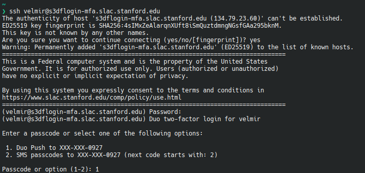
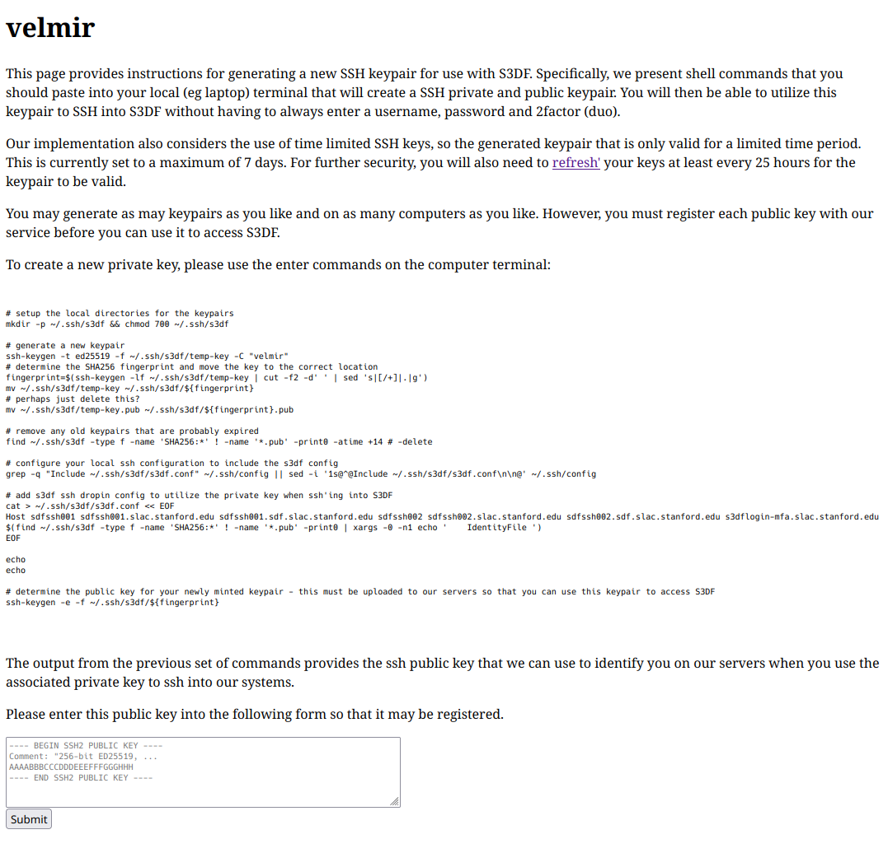

# S3DF SSH with Multi-Factor Authentication

## SSH and Multi-Factor
Multi-Factor Authentication (MFA) provides an additional layer of security for users and S3Df SSH logins. As a preliminary rollout, MFA has been configured on the `s3dflogin-mfa.slac.stanford.edu` bastion hosts.

## Passwords and MFA
>ℹ️ If you don't already have Duo configured, please see SLAC's documentation [here](https://it.slac.stanford.edu/support/KB0010216]

1. When using password login, please use your SLAC Account (formerly "SLAC Windows account") credentials when connecting with SSH to `s3dflogin-mfa.slac.stanford.edu`.
2. You will be prompted for your SLAC Account password
3. After successfully entering your SLAC Account password, you will receive a Duo challenge. 
4. To complete the challenge, do one of:
  * Enter option `1` to send a notification to your Duo app
  * Enter option `2` to send an SMS message to your phone
  * Activate your registered security key (such as a Yubikey)

## SSH Keys and MFA
To use SSH key login, public keys must be registered with the S3DF key management system in order to be used with `s3dflogin-mfa.slac.stanford.edu` bastion hosts.

There are two important concepts to keep in mind while managing your S3DF public keys **"valid"** and **"unexpired"** keys.
* An **unexpired** key can be used and refreshed any number of times for a maximum of **7 days**, at which point it expires.
  * Expired keys *cannot* be reused, reuploaded, reregistered, or refreshed
* A **valid** key is an unexpired key that has been refreshed in the last **25 hours**
  * A valid key can be refreshed any number of times
  * Refreshing a valid key resets the validity period
  * Refreshing a valid key has *no effect* on the expiry period

>ℹ️ You may register as may keys as you like on as many computers as you like as long as each is registered with the S3DF SSH Key Service

### S3DF SSH Key Service
Log in to the [SSH key management service](https://s3df-sshkeys.slac.stanford.edu) in a web browser. You will be required to log in using an MFA method.

You will arrive at a welcome page with two options: to `Register Public Key` or `List Public Keys`.  


#### Registering a New SSH Key
To add a public key, click the `Register Public Key` button. You will be taken to the SSH key registration page:  


Ensure the username in large type at the top of the page is the name of the account you want to manage.

For your convenience, there is a code block in the middle of the page you may copy and paste into your terminal.
It does several things on your computer for you:
* A subdirectory for S3DF keys is created as `.ssh/s3df` in your home directory
* A new, secure SSH key pair is generated. You may add a passphrase to the key if you wish
* A configuration line is added to your `.ssh/config` file to associate the new SSH key with S3DF bastion hosts
* The public key is printed on the terminal in SSH2 format

Whether you used the copied code or created a key pair yourself, copy the text of the **SSH2-formatted public key**. At the bottom of the page is a box for you to paste the SSH2-formatted public key. Paste it there and press the "Submit button.  


SSH2 format looks like this:
```
---- BEGIN SSH2 PUBLIC KEY ----
Comment: "256-bit ED25519, converted by user@hosstname"
AAAAC3NzaC1lZDI1NTE5AAAAIJEVMB7OgUzz6cfWJmgKfmsGG2/M82MEG7/r6r1SmjVY
---- END SSH2 PUBLIC KEY ----
```
The SSH2 formatted key can be retrieve from the key file by running `ssh-keygen -e -f ~/.ssh/s3df/<name of key>`

>ℹ️ A newly uploaded key will expire after 7 days.

#### Managing and Refreshing Keys
An unexpired key remains valid for 25 hours after which time it must be refreshed.
To refresh a key, visit the [SSH key management service](https://s3df-sshkeys.slac.stanford.edu) and click the "List Public Keys" button.

You will be shown a list of your registered keys. If the list is empty, you may need to register a key as described [above](#registering-a-new-ssh-key).
To refresh a key's 7-day validity period, click the "Refresh" button to the right of that key. Only unexpired keys can be refreshed.

If you wish to make a key invalid before the validity period would otherwise end, click the "Inactivate" button next to that key.

>ℹ️ An expired key **cannot** be refreshed

SSH keys are identified by their fingerprints. A key's fingerprint can be retrieved from the public key by running `ssh-keygen -l -f ~/.ssh/s3df/<name of key>`
