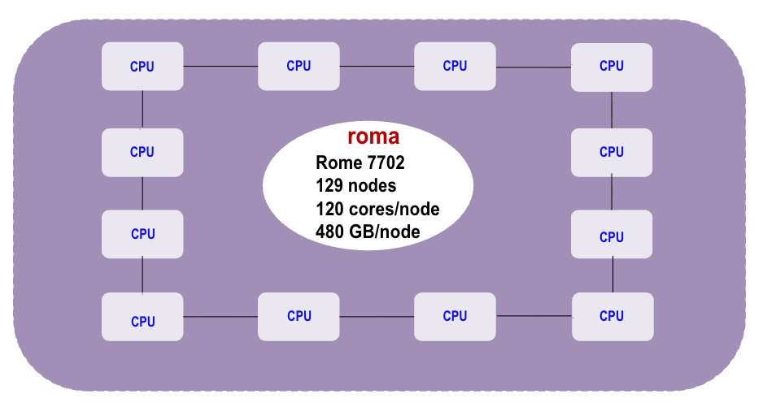
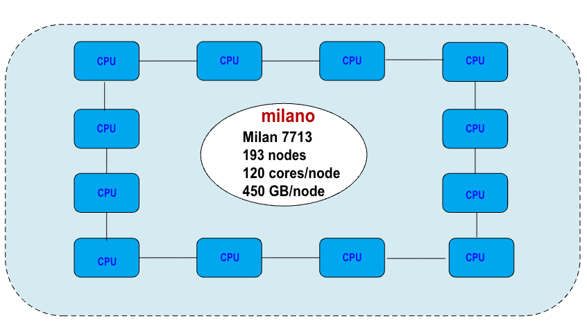
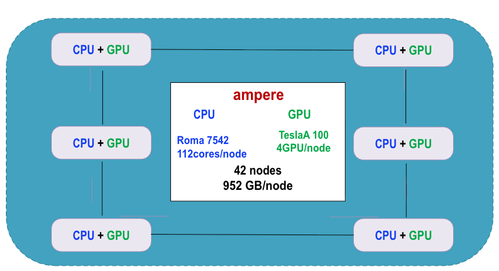
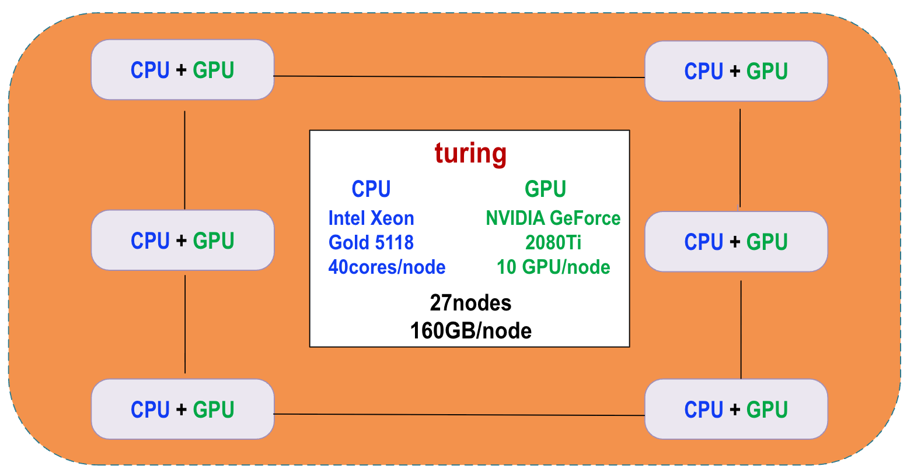
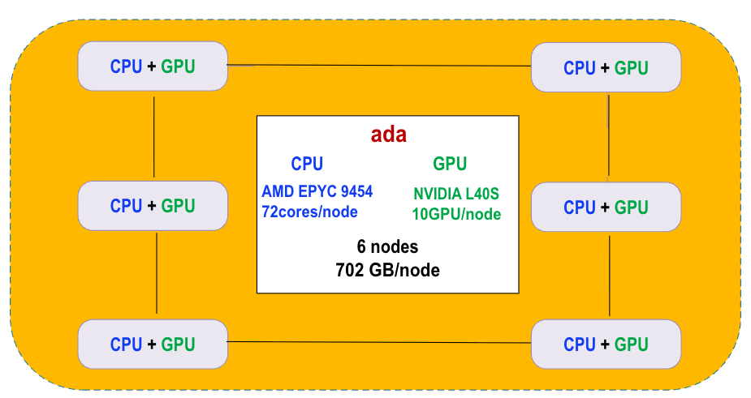

# Computing Resources

## roma

 - CPU Model: Rome 7702
 - Usable Cores per Node: 120
 - Usable Memory per Node: 480 GB
 - GPU Model: None
 - GPUs per Node: None
 - Local Scratch: 300 GB
 - Number of Nodes: 129
 Overview: The Roma cluster is equipped with 120 cores and 480 GB of memory per node, making it suitable for a variety of computational tasks requiring substantial processing power.

   
   
## milano

 - CPU Model: Milan 7713
 - Usable Cores per Node: 120
 - Usable Memory per Node: 480 GB
 - GPU Model: None
 - GPUs per Node: None
 - Local Scratch: 6 TB
 - Number of Nodes: 193
   Overview: The Milano cluster features similar core and memory specifications as the Roma cluster but offers significantly larger local scratch space (6 TB), making it ideal for data-intensive applications.

   
   
## ampere

 - CPU Model: Rome 7542
 - Usable Cores per Node: 112 (hyperthreaded)
 - Usable Memory per Node: 952 GB
 - GPU Model: Tesla A100 (40 GB)
 - GPUs per Node: 4
 - Local Scratch: 14 TB
 - Number of Nodes: 42
Overview: The Ampere cluster offers high memory and GPU capabilities with 4 Tesla A100 GPUs per node, making it well-suited for machine learning and high-performance computing tasks that require both substantial memory and processing power.

   
   
## turing

 - CPU Model: Intel Xeon Gold 5118
 - Usable Cores per Node: 40 (hyperthreaded)
 - Usable Memory per Node: 160 GB
 - GPU Model: NVIDIA GeForce 2080Ti
 - GPUs per Node: 10
 - Local Scratch: 300 GB
 - Number of Nodes: 27
Overview: The Turing cluster combines a moderate number of cores with multiple NVIDIA GeForce 2080Ti GPUs, making it suitable for graphical computations, simulations, and parallel processing tasks.

   
   
## ada
CPU Model: AMD EPYC 9454
Usable Cores per Node: 72 (hyperthreaded)
Usable Memory per Node: 702 GB
GPU Model: NVIDIA L40S
GPUs per Node: 10
Local Scratch: 21 TB
Number of Nodes: 6
Overview: The Ada cluster features high-core counts and ample memory, along with 10 NVIDIA L40S GPUs per node, providing excellent resources for advanced computation and research requiring both CPU and GPU resources.

   
   
Refer to the table below to find the specifications for each cluster

| Partition name | CPU model | Useable cores per node | Useable memory per node | GPU model | GPUs per node | Local scratch | Number of nodes |
| --- | --- | --- | --- | --- | --- | --- | --- |
| roma | Rome 7702 | 120 | 480 GB | - | - | 300 GB | 129 |
| milano | Milan 7713 | 120 | 480 GB | - | - | 6 TB | 193 |
| ampere | Rome 7542 | 112 (hyperthreaded) | 952 GB | Tesla A100 (40GB) | 4 | 14 TB | 42 |
| turing | Intel Xeon Gold 5118 | 40 (hyperthreaded) | 160 GB | NVIDIA GeForce 2080Ti | 10 | 300 GB | 27 |
| ada | AMD EPYC 9454 | 72 (hyperthreaded) | 702 GB | NVIDIA L40S | 10 | 21 TB | 6 |
